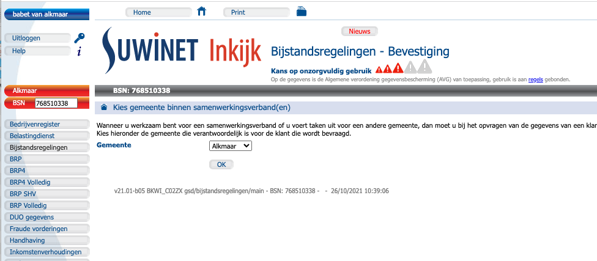

# Beschrijving huidige situatie SI Classic

[[_TOC_]]

# Introductie

Bij de gemeentelijke werkzaamheden moet gelogd worden welke BSN's opgevraagd worden
in een gegeven context. Deze logging wordt dan door Splunk opvraagbaar gemaakt.

Momenteel is deze functionaliteit nog niet aanwezig in SI Upgrade.  
Het doel van dit project is om de functionaliteit te implementeren.

# Overzicht werking

## Configuratie

### UserAdmin: configuratie van de gemeentelijke samenwerkingsverbanden

De configuratie wordt geïmplementeerd via de useradmin gui.  
Deze kan benaderd worden via SI Classic:
- Inloggen met de nodige rechten (in ontwikkeling b.v. **developer**).
- Click op button **Services**.
- Click op **useradmin**.
- Click op button **Eén login**.

Het volgende scherm wordt dan zichtbaar:


De gegevens, die hier getoond worden baseren op de MySQL database useradmin.
Een voorbeeld van een query:

```sql
select sv.`naam` sv_samenwerkingsverband
,      sv.id
,      sv.begin  sv_begin
,      sv.eind   sv_eind
,      gp.naam   gp_naam
,      gp.uitvoerend
,      gp.begin  gp_begin
,      gp.eind   gp_end
,      gp.type_organisatie
from   gemeente_participatie gp
,      samenwerkingsverband  sv
where  gp.`samenwerkingsverband_id` = sv.`id`
and    sv.id = 7
order by sv.id
,      gp.id
;
```

Met als resultaat:
```sql
+---------------------------------------+----+------------+---------+------------------------------------------+------------+------------+--------+----------------------+
| sv_samenwerkingsverband               | id | sv_begin   | sv_eind | gp_naam                                  | uitvoerend | gp_begin   | gp_end | type_organisatie     |
+---------------------------------------+----+------------+---------+------------------------------------------+------------+------------+--------+----------------------+
| samenwerkingsverband Den Haag 4 (vb4) |  7 | 2021-09-21 | NULL    | Den Haag                                 |          0 | 2021-09-21 | NULL   | GEMEENTE             |
| samenwerkingsverband Den Haag 4 (vb4) |  7 | 2021-09-21 | NULL    | Delft                                    |          0 | 2021-09-21 | NULL   | GEMEENTE             |
| samenwerkingsverband Den Haag 4 (vb4) |  7 | 2021-09-21 | NULL    | Alphen aan den Rijn                      |          0 | 2021-09-21 | NULL   | GEMEENTE             |
| samenwerkingsverband Den Haag 4 (vb4) |  7 | 2021-09-21 | NULL    | Eemsmond                                 |          0 | 2021-09-21 | NULL   | GEMEENTE             |
| samenwerkingsverband Den Haag 4 (vb4) |  7 | 2021-09-21 | NULL    | Drunen op de hei (zit niet meer in LDAP) |          0 | 2021-09-21 | NULL   | GEMEENTE             |
| samenwerkingsverband Den Haag 4 (vb4) |  7 | 2021-09-21 | NULL    | samenwerkingsverband Den Haag 4 (vb4)    |          1 | 2021-09-21 | NULL   | SAMENWERKINGSVERBAND |
+---------------------------------------+----+------------+---------+------------------------------------------+------------+------------+--------+----------------------+
```

### Gebruikersadministratie: linken van gebruikers aan gemeentelijke samenwerkingsverbanden

In de Gebruikersadministratie kunnen (uiteraard) gebruikers aangemaakt en rechten toegekend worden.  
Doordat de gebruiker aan een bepaalde gemeente / samenwerkingsverband verbonden is gedraagd de applicatie zich anders (deze heeft door dat de gebruiker in een samenwerkingsverband zit). 
De SuwiDesk kan dit online regelen via de "Eén login" schermen - en dit werkt ook vrijwel meteen.
Voor de duidelijkheid: er hoeft dus niks aangepast te worden aan de gebruikersaccounts en ook niks met rollen te gebeuren.

De Gebruikersadministratie kan benaderd worden via SI Classic:
- Inloggen met de nodige rechten (in ontwikkeling b.v. **developer**).
- Click op button **Gebruikersadministratie**.

Het volgende is dan zichtbaar:


- Kies **GSD** (als voorbeeld).

Nu zijn er diverse mogelijkheden:
- Het bekijken van een overzicht.
  - Kies (optioneel) een veld in een submap. B.v. **/SUWI/gsd/samenwerkingsverband Den Haag 4 (vb4)**.
    - Noot: er kan hier ook voor een gemeente gekozen worden.
  - Click op button "Zoek".

Het volgende is dan zichtbaar (click om te vergroten):
- Hierin wordt aangegeven wie voor welke afdeling werkt en welke functierollen hij heeft.


- Het aanmaken van een nieuwe gebruiker.
  - Click op bovenstaande venster op button **Nieuwe gebruiker**.
    - Nu kan voor **/SUWI/gsd/samenwerkingsverband Den Haag 4 (vb4)** een nieuwe gebruiker gedefinieerd worden.
      - Gegevens
      - Rollen
      - Status
      - Wachtwoord


Het voert te ver om hier alle mogelijkheden via screenshots te tonen.

## SOAP service UserAdmin-v0100

De functionaliteit van **1Login** in SI Classic wordt ondersteund door middel van SOAP service UserAdmin-v0100.  
Deze SOAP service geeft voor een gegeven gebruiker, die intern geïdentificeerd wordt door een
userDN, de eventueel mogelijke gemeentes in een samenwerkingsverband.

De functionaliteit wordt in het volgende uitgelegd.

### Overzicht van gebruikte SOAP request

- Click op button **Suwinet-Inkijk**.
- De pagina, die nu getoond word is: 
  - http://localhost/suwinet-inkijk/rh/bkwi/admin/admin
    - Hier kunnen diverse settings gewijzigd worden, b.v. het wijzigen van het log-level.
- Click op **common: admin | info**.
  - De pagina, die nu getoond wordt is:
    - http://localhost/suwinet-inkijk/rh/bkwi/info/info.
      - Zie hieronder een screenshot van de getoonde pagna.
      - Deze pagina toont o.a. een overzicht van de gebruikte SOAP requests
      - Het SOAP request, dat relevant is voor **Eén Login** is:
        - InkijkRequest.url.UserAdmin-v0100=http://localhost/services/services/UserAdmin-v0100

Als naar de admin info gekeken wordt dan wordt het volgende zichtbaar:


### Opzet van de UserAdmin-v0100 SOAP service

De wsdl voor de SOAP service UserAdmin-v0100 is aanwezig in project sas:
- $ws/sas/services/useradmin/src/main/resources/META-INF/UserAdmin-v0100/UserAdmin-v0100.wsdl
- De operatie, die hier i.e.i. voor ons van belang is:
  - getRelatedParticipations

### Voorbeeld van het testen van de UserAdmin-v0100 SOAP service via SOAPUI

Allereerst dient SI Classic online te zijn. Zie hiervoor [Deployment Suwinet Inkijk Classic](https://office.bkwi.nl/sas/sas-documentation/inkijk/deployment_SI_Classic.html)

- Start SoapUI op.
- Start een nieuw project.
- Voer in het pad de bovengenoemde wsdl in.
  - Aangevinkt moet zijn: **Create sample requests for all operations**.
- Select operation **getRelatedParticipations**.
  - De getoonde url is:
    - **http://localhost/services/services/UserAdmin-v0100.UserAdmin-v0100HttpSoap11Endpoint/**
  - Haal hiervan het laatste onderdeel weg. De url wordt dan:
    - **http://localhost/services/services/UserAdmin-v0100**
- Als een voorbeeld account kan de volgende userDN gebruikt worden:
  - Zie resource (4):
    - Naam: **Babet van Alkmaar**
    - User: **0001_gsd_alkmaar_we**
    - DN: **cn=babet van alkmaar,ou=alkmaar,ou=gsd,o=suwi,c=nl**
- Het SOAP request ziet dan als volgt uit:

```xml
<soapenv:Envelope xmlns:soapenv="http://schemas.xmlsoap.org/soap/envelope/" xmlns:v01="http://bkwi.nl/SuwiML/Diensten/UserAdmin/v0100">
   <soapenv:Header/>
   <soapenv:Body>
      <v01:getRelatedParticipations>
         <userDn>cn=babet van alkmaar,ou=alkmaar,ou=gsd,o=suwi,c=nl</userDn>
      </v01:getRelatedParticipations>
   </soapenv:Body>
</soapenv:Envelope>
```
- De response is dan als volgt:

```xml
<soapenv:Envelope xmlns:soapenv="http://schemas.xmlsoap.org/soap/envelope/">
   <soapenv:Header/>
   <soapenv:Body>
      <ns1:getRelatedParticipationsResponse xmlns:ns1="http://bkwi.nl/SuwiML/Diensten/UserAdmin/v0100">
         <participation>Alkmaar</participation>
         <participation>Castricum</participation>
         <participation>Enschede</participation>
      </ns1:getRelatedParticipationsResponse>
   </soapenv:Body>
</soapenv:Envelope>
```

### Ondersteunende Java functionaliteit.

Deze SOAP functionaliteit wordt in project inkijk aangeroepen.  
Dit is geconfigureerd in:
- $ws/inkijk/suwinet-inkijk/conf/classes.cfg
  - InkijkRequest.url.UserAdmin-v0100 = [Services.url]$3
- De SOAP service is via de volgende Java class beschikbaar:
  - /$ws/sas/services/useradmin/src/main/java/nl/bkwi/services/useradmin/v0100/UserAdminV0100.java
    - De voor **1Login** relevante methode is:
      - getRelatedParticipations()
      
# Voorbeeld van gebruik in SI Classic

## Het gebruik via de GUI

- Log in als **0001_gsd_alkmaar_we** (Babet van Alkmaar)
- Het onderstaande scherm wordt nu zichtbaar (minder functionaliteit dan beschikbaar voor gebruiker **developer**).


- Vul nu een BSN in, b.v. **111111110**.
- Click nu (als voorbeeld) op button **Bijstandsregelingen**.
- Het volgende wordt nu zichtbaar:


De getoonde plaatsnamen komen overeen met de plaatsnamen, getoond in de SOAP response.
Als de juiste plaats gekozen is dan wordt op de button **OK** gedrukt (die onder de dropdown list valt).

## Het zetten van een voorkeursgemeente

### Achtergrond

In SI Classic zal een account, dat werkzaam is voor een samenwerkingsverband een voorkeursgemeente
kunnen vastleggen. Hierbij kan gekozen worden uit één van de gemeentes, die in het samenwerkingsverband
aanwezig zijn.

### Keuze van de voorkeursgemeente

Als ingelogd is met een account, dat werkzaam is voor een samenwerkingsverband, is op de hoofdpagina
onder **Overig** de button **Wijzigen voorkeursgemeente samenwerkingsverband** zichtbaar.  

Als hierop geclicked wordt en op de dropdown list geclicked wordt het volgende zichtbaar:
Als vervolgens op de button **Opslaan** geclicked wordt is de gekozen gemeente vastgelegd.


Als dan een volgende keer het account van het samenwerkingsverband een functionaliteit kiest
dan wordt bij het voorleggen van het 1Login tussenscherm in de dropdown list meteen de 
voorkeursgemeente getoond en kan deze meteen via clicken op de butten **OK** weer gekozen worden.

Zie hieronder voor de getoonde voorkeursgemeente:


### Het bewaren van de voorkeursgemeente

De voorkeursgemeente voor een gegeven account wordt vastgelegd in tabel **PROFILE** in 
database **SUWINETINKIJK**.
Het volgende is dan zichtbaar:

```sql
mysql> select context, name, value from profile;
+----------------------------------------------------+----------------------------------------+---------------------------------------------------------------------+
| context                                            | name                                   | value                                                               |
+----------------------------------------------------+----------------------------------------+---------------------------------------------------------------------+
| cn=babet van alkmaar,ou=alkmaar,ou=gsd,o=suwi,c=nl | LastUpdate                             | 20211026102537                                                      |
| cn=babet van alkmaar,ou=alkmaar,ou=gsd,o=suwi,c=nl | Samenwerkingsverband.voorkeursgemeente | Alkmaar                                                             |
| cn=babet van alkmaar,ou=alkmaar,ou=gsd,o=suwi,c=nl | home.HomePageSecurityBlock             | report=Bijstandsregelingen|bsnrequest=*****0338|time=20211026104109 |
| cn=babet van alkmaar,ou=alkmaar,ou=gsd,o=suwi,c=nl | home.UserNonce                         | 052B782086608B86A977257C49874145                                    |
| cn=developer,ou=bkwi,o=suwi,c=nl                   | home.HomePageSecurityBlock             | report=Suwinet-Inkijk homepage|bsnrequest=|time=20211026085359      |
| cn=developer,ou=bkwi,o=suwi,c=nl                   | home.UserNonce                         | 052B782086608B86A977257C49874145                                    |
+----------------------------------------------------+----------------------------------------+---------------------------------------------------------------------+
```

In tabel **PROFILE** is dus niet alleen vastgelegd wat voor het account de voorkeursgemeente is,
maar tevens voor welke functionaliteit (in dit geval Bijstandsregelingen) dit gebeurt is, wanneer
en voor welke BSN.

## Logging

In SI Classic wordt de applicatie compiled in een war-file die vervolgens in een lokale Tomcat webserver geplaatst wordt.
- Deze Tomcat webserver is aanwezig in **$th**.
- De logging is aanwezig in: **$th/logs**.
- Voor de logging van **1Login** wordt gekeken naar:
  - suwinet-inkijk-custom-access.log

Voor de keuze van de gemeente is in de logging zichtbaar:
```
info3 20210927-00:03:53 "BKWI_C02ZX41RMD6R","11644100343908","GET","false","true","2021-09-27 00:03:52","2021-09-27 00:03:53",633,"true",4,2021,9,"september",27,"maandag","0001_gsd_alkmaar_we","cn=babet van alkmaar,ou=alkmaar,ou=gsd,o=suwi,c=nl","babet van alkmaar","gsd","alkmaar",,,"BASIS_GSD,R1,WE_GSD","2d6421d5e27c40a3aa91ba11a2cbe806fbe966aafdd3cc74670bcf9cd26e7bb4185d7f4d72bb38ae088424814c24ce1f165c457b0176ccf79741175a7a8d9451","gsd","bijstandsregelingen","main","Burgerservicenr=111111110","11644100343909&11644100343910","http://localhost/suwinet-inkijk/rh/gsd/bijstandsregelingen/main?_Burgerservicenr=111111110&format=html&look=december-2008",,,,"gemeente scherm",,
```

Na de keuze van de gemeente, in dit geval Castricum, is in de logging zichtbaar:
```
info3 20210927-00:39:19 "BKWI_C02ZX41RMD6R","11644100343911","GET","false","false","2021-09-27 00:39:18","2021-09-27 00:39:19",323,"true",4,2021,9,"september",27,"maandag","0001_gsd_alkmaar_we","cn=babet van alkmaar,ou=alkmaar,ou=gsd,o=suwi,c=nl","babet van alkmaar","gsd","alkmaar",,,"BASIS_GSD,R1,WE_GSD","2d6421d5e27c40a3aa91ba11a2cbe806fbe966aafdd3cc74670bcf9cd26e7bb4185d7f4d72bb38ae088424814c24ce1f165c457b0176ccf79741175a7a8d9451","gsd","bijstandsregelingen","main","Burgerservicenr=111111110&municipality=Castricum","11644100343912","http://localhost/suwinet-inkijk/rh/gsd/bijstandsregelingen/main?_Burgerservicenr=111111110&_municipality=Castricum&_nf-button-ok=y&confirming-showingRelatedParticipations=yes&format=html&formed=20210927000352&look=december-2008&xmlCacheId=41",,,"Castricum",,,
```
In de logging is o.a. het volgende zichtbaar:
```
- Login             : "0001_gsd_alkmaar_we"
- userDN            : "cn=babet van alkmaar,ou=alkmaar,ou=gsd,o=suwi,c=nl"
- Username          : "babet van alkmaar"
- Organisatie       : "gsd"
- Plaats van de user: "alkmaar"
- BSN               : "111111110"
- Voor de keuze     : "gemeente scherm"
- Na de keuze       ; "Castricum"
```

# Resources

1. https://office.bkwi.nl/sas/sas-documentation/inkijk/deployment_SI_Classic.html
2. $ws/inkijk/suwinet-inkijk/doc/info/index.html
3. $ws/inkijk/suwinet-inkijk/doc/info/logfile-suwinet-inkijk-custom-access.html
4. $ws/inkijk/suwinet-inkijk/doc/info/samenwerkingsverbanden-sas.html
5. $ws/sas/services/useradmin/src/main/resources/META-INF/UserAdmin-v0100/UserAdmin-v0100.wsdl

[back to main](../README.md) |
[previous](./03_Overzicht_oplevering.md) |
[next](./05_Beschrijving_Whitelist_Handling_SI_Upgrade.md)