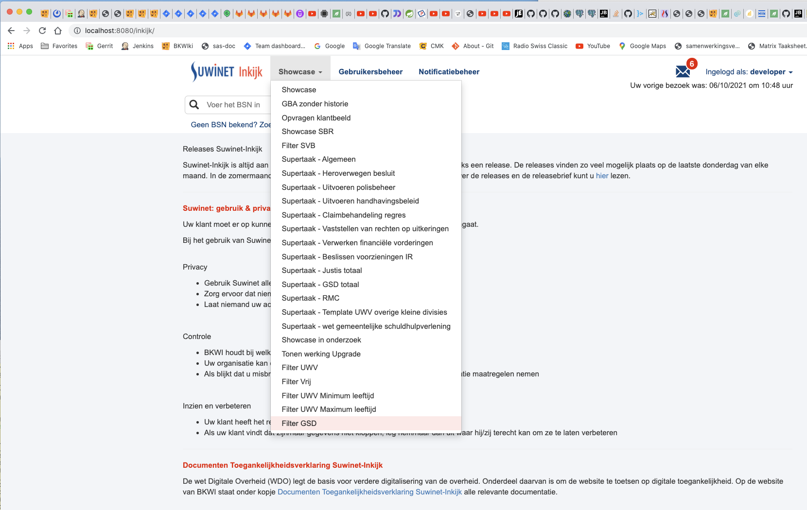
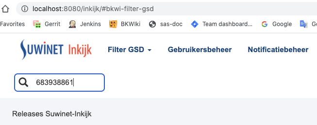
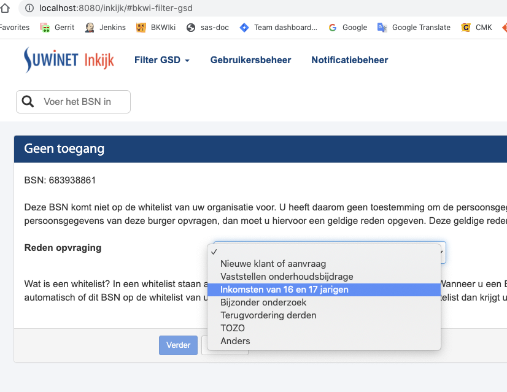
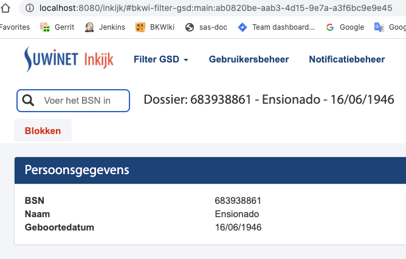
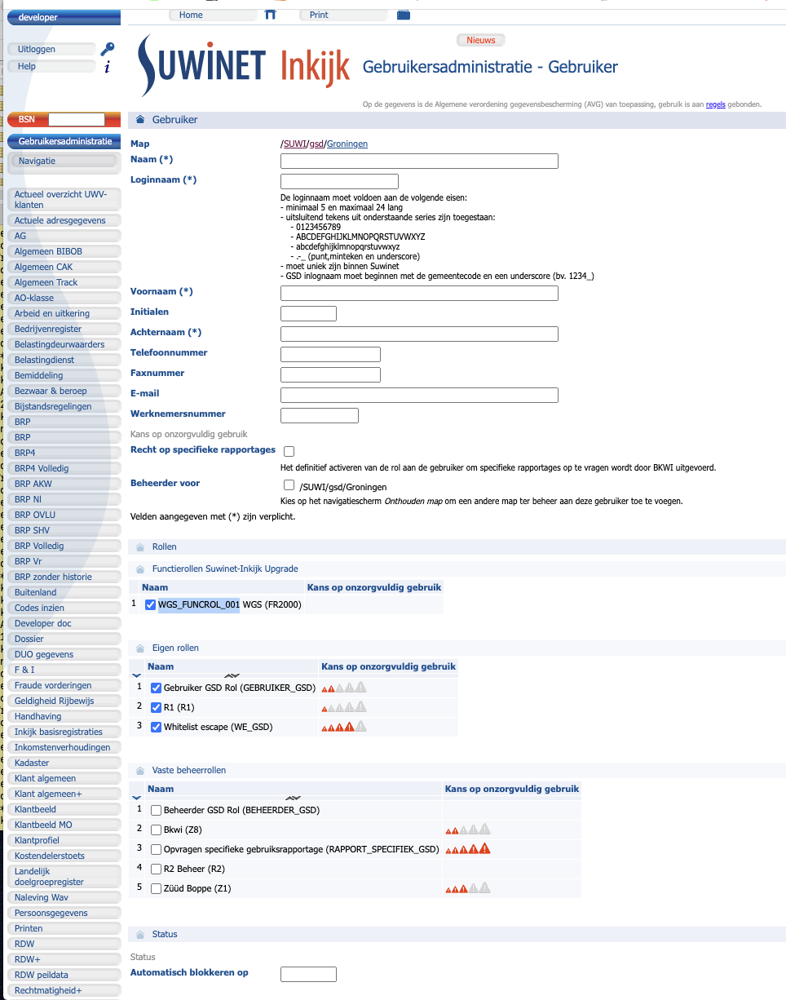

# Beschrijving van de Whitelist handling in SI Upgrade.

[[_TOC_]]

# Introductie

De whitelist handling voor een gemeente betekent, dat voor een gemeente een lijst van BurgerServiceNummers (BSN) 
bestaat, die door b.v. een ambtenaar van die gemeente ingekeken worden kan.  
Indien een BSN opgegeven wordt, die niet op die whitelist voorkomt, dan dient daarvoor een reden opgegeven te worden.  
Dit wordt dan gelogd.

De implementatie van whitelisting kan mogelijk als voorbeeld voor de implementatie van 1Login in SI Upgrade gebruikt worden.  
Om die reden moet de whitelisting functionaliteit onderzocht worden.  
Hierbij zal gekeken worden naar:
- De werking voor een gebruiker
- De technische achtergrond (geïmplementeerde code)
- Openstaande vragen

# Functionele beschrijving van het gebruik van whitelisted in SI Upgrade

Momenteel kan whitelisting als volgt in SI Upgrade bekeken worden:
- Log in als user **developer**.
- Kies als taaksheet **Filter GSD**.
- Voer een BSN in, die niet op de whitelist voorkomt, in ons voorbeeld BSN **683938861**.
- Vervolgens wordt een tussenscherm getoond met een verklarende tekst en een dropdown veld
  waarin een reden gekozen worden kan om door te gaan.
- De gewenste functionaliteit is nu toegankelijk.

Dit ziet als volgt uit:

## Kies als taaksheet **Filter GSD**.



## Voer een BSN in, die niet op de whitelist voorkomt, in ons voorbeeld BSN **683938861**.

Normaliter zou de ambtenaar de gegevens van de persoon met deze BSN niet mogen bekijken en hierop
handelingen uit te voeren.  
Er kan echter een gegronde reden bestaan om dit alsnog te doen.



## Kies de reden om de persoonsgegevens in te zien.



## De persoonsgegevens kunnen ingezien en eventueel bewerkt worden.



# De technische achtergrond (geïmplementeerde code) van de whitelist handling

De implementatie is aanwezig in project sas.

## Implementatie per module

### Module services-stub

#### Stub-data voor de ondersteuning van SI Upgrade

- $ws/sas/services/stub/src/main/resources/stub/responses/UWVDossierInkomsten-v0600/
  - UWVPersoonsIkvInfo/
    - 683938861.xml
      - **Deze stub-data is niet vermeld in stubdata.apt!!**

### Module inkijk-client

In deze module is het initiële scherm voor **Filter GSD** opgezet. 

- $ws/sas/inkijk/client/src/main/java/nl/bkwi/client/inkijk/activity/
  - InkijkView.java
    - public void showFilterEscapePage(Layout layout, WorkloadStatusResult result)
      - EscapeWidget widget = new EscapeMechanism(presenter, searchBsnForEscapeWindow);
    - Hier wordt ervoor gezorgd, dat het initiële scherm getoond wordt.

Initial frontend (Geen toegang, etc.)

- $ws/sas/inkijk/client/src/main/java/nl/bkwi/client/inkijk/ui/filter/
  - EscapeWidget.java
    - Definition of the backend / controller class.
  - EscapeMechanism.java
    - The controller class.
  - Escape.ui.xml
    - Definition of the initial frontend.
  - MainText
    - Definition of the text on the initial frontend
      - gsd / svb / uwv

### Module inkijk-config / inkijk-testconfig

#### Configuratie van de aanroep van FilterToets-v0100

In svb.json en svb-rule.json wordt de toepassing van FilterToets-v0100 geconfigureerd.

- $ws/sas/inkijk/config/src/main/resources/definitions/filter/
  - svb.json
```json
{
    "parameters": [
        "FilterToets-v0100.FilterToets/Toetsen/Filtercriterium/NaamFiltercriterium", "FilterToets-v0100.FilterToets/Toetsen/Filtercriterium/WaardeFiltercriterium"
    ],
    "description": [
        "Filteren van svb filtertoets."
    ],
    "id": "svb",
    "rules": [
        "svb-rule"
    ]
}
```
- $ws/sas/inkijk/config/src/main/resources/definitions/filterrules/svb-rule.json
```json
{
    "parameters": [
        "FilterToets-v0100.FilterToetsResponse/ResultaatFilterToets/IndVoldoetAanFilter"],
    "description": [
        "Filtertoets voor svb."
    ],
    "id": "svb-rule"
}
```

#### Overige configuratie

In de organization files wordt het verband tussen OIN, userDN en naam vastgelegd.

- $ws/sas/inkijk/testconfig/src/main/resources/definitions/task/
  - bkwi-filter-gsd.json
    - Bevat: **"filter" : "whitelist-toets"**
      - Dit is de indicatie, dat de whitelist-toets toegepast worden moet.

- $ws/sas/inkijk/config/src/main/resources/definitions/organization/ 
    - 00000001002179908000.json
      - "oin": "00000001002179908000",  
        "name": "Sociale Verzekeringsbank",  
        "statutes": [],  
        "displayFunctionRoleAsTask" : true,  
        "distinguishedNames": [  
        "ou=svb,o=suwi,c=nl"  
        ],  
      - "escapeReasons":["Gevalsbehandeling","Onderzoek kostendeler/relatie","Verwerken papieren uitval","Handhavingsonderzoek", "Analyse incident/change","Accountbeheer TWinternet","BBZ/BDZ","OC/IAD/Kwaliteitsonderzoek","Sociaal attaché"],
      - "escapeMessageType" : "svb"
    - 00000001810220350000.json
      - "oin": "00000001810220350000",  
        "name": "Uitvoeringsinstituut Werknemersverzekeringen (UWV)",  
        "statutes": [],  
        "displayFunctionRoleAsTask" : true,  
        "changePasswordSupport": false,  
        "distinguishedNames": [  
        "ou=uwv,o=suwi,c=nl",  
        "ou=cwi,o=suwi,c=nl"  
        ],
      - "escapeReasons":[ "UWV werk" ]
    - 00000099810237118000.json
      - "oin": "00000099810237118000",  
        "name": "Dummy Release Gemeente",  
        "statutes": [],  
        "distinguishedNames": [  
        "ou=dummy release gemeente,ou=gsd,o=suwi,c=nl",  
        "ou=demo vng,ou=gsd,o=suwi,c=nl"  
        ],  
      - "eescapeReasonsscapeReasons":["Nieuwe klant of aanvraag", "Vaststellen onderhoudsbijdrage","Inkomsten van 16 en 17 jarigen","Bijzonder onderzoek", "Terugvordering derden","TOZO","Anders"],
      - "escapeMessageType": "gsd"
    - 00000001810237118000.json
      - "oin": "00000001810237118000",
        "name": "BKWI",
        "statutes": [],
        "distinguishedNames": [
        "ou=bkwi,o=suwi,c=nl"
        ],
      - "escapeReasons": [
        "Gevalsbehandeling",
        "Onderzoek kostendeler/relatie",
        "Verwerken papieren uitval",
        "Handhavingsonderzoek",
        "Analyse incident/change",
        "Accountbeheer TWinternet",
        "BBZ/BDZ",
        "OC/IAD/Kwaliteitsonderzoek",
        "Sociaal attaché"
        ],
        "escapeMessageType": "uwv"

### Module inkijk-model

- $ws/sas/inkijk/model/src/main/java/nl/bkwi/inkijk/model/
  - AnalyseModel.java
    - An AnalyseModel contains the base information for the Task-, Organization- and Message model.

### Module inkijk-webapp


- $ws/sas/inkijk/webapp/src/main/java/nl/bkwi/inkijk/server/inkijk/model/
  - ConfigurationModel.java  extends AnalyseModel
    - A consistent configurationModel (task, message, codelist) and a implementation for every needed 
    {@link ConversionRule} and {@link TransformationRule} so that this model can be used in a release.
    - ConfigurationModelWithRuleImplementations.java  implements ConfigurationModel
      - Via deze class kunnen gegevens in de json files in **module inkijk-config** uitgelezen worden:
        - $ws/sas/inkijk/config/src/main/resources/definitions/.

### Module services-useradmin

- $ws/sas/services/useradmin/src/main/resources/META-INF/UserAdmin-v0100/UserAdmin-v0100.wsdl
  - The WSDL of the SOAP service that exposes MySQL database useradmin.
  - This service is not exposed via the broker.
- $ws/sas/services/useradmin/src/main/java/nl/bkwi/services/useradmin/v0100/
  - UserAdminV0100.java
    - Method getRelatedParticipations() will Get all related participations for a  the municipality in a given userDn.
  - dao/Participation.java
  - dao/api/ParticipationDaoHibernate.java

# De aanmaak van een account voor SI Upgrade

## Resources

[user-configuratie-bij-nieuwe-supertaak.html](https://office.bkwi.nl/sas/sas-documentation/inkijk/user-configuratie-bij-nieuwe-supertaak.html)

## The creation of (test)users

- $ws/sas/services/useradmin/src/test/java/nl/bkwi/services/useradmin/ldap/TestUsersCreator.java
- $ws/sas/docker/opendj/seed/import_users.ldif
  - Hier worden de gegenereerde accountgegevens getoond.
    - Geeft het verband weer tussen userDN, naam, user id, etc. maar geen OIN.
      - De OIN wordt in organization files (module inkijk-config) verbonden met de userDN.

## Voorbeeld van het gebruik van een account, aangemaakt in SI Classic, met toegang tot SI Upgrade

Als voor **/SUWI/gsd/Groningen** een account aangemaakt wordt dan kan gekozen worden om een **Suwinet Inkijk
Upgrade** functierol toe te kennen.  
Tevens kan dan de rol voor **Whitelist escape** toegekend worden.

Zie hieronder:


De functierol is dan aanwezig in:
- $ws/sas/inkijk/config/src/main/resources/definitions/organization/00000001825783434000.json
  - "WGS_FUNCROL_001"
    - De functierol "FR2000" bevat de externalId "**"WGS_FUNCROL_001"**", die voor WGS toegang geeft tot SI Upgrade.
      - WGS = Wet Gemeentelijke Schuldhulpverlening
```json
{
	"oin": "00000001825783434000",
	"name": "Gemeente Groningen",
	"statutes": [],
	"distinguishedNames": [
		"ou=groningen,ou=gsd,o=suwi,c=nl",
		"ou=groningen,ou=gb,o=suwi,c=nl",
		"ou=groningen,ou=bz,o=suwi,c=nl",
		"ou=groningen,ou=wgs,o=suwi,c=nl"
	],
	"functionRoles": [
		{
		"functionRoleId": "FR2000",
		"externalId": "WGS_FUNCROL_001",
		"name": "WGS",
		"taskIds": ["gemeente-wgs-001"],
		"inkijkPageIds": []
	}
	],
	"splunkName": "groningen",
	"reportsets": [
		"gemeente"
	]
}
```

In principe zal ieder account met functierol zoals **FR2000** in de organisatie json file toegang hebben SI Upgrade.
In dit geval voor WGS. Indien deze organisatie gekoppeld is aan een taak met een **"filter" : "whitelist-toets"**
dan zal de **whitelist-toets** uitgevoerd worden.


Als voorbeeld:
- /$ws/sas/inkijk/testconfig/src/main/resources/definitions/task/bkwi-filter-gsd.json
```json
  "filter" : "whitelist-toets",
  "id" : "bkwi-filter-gsd",
  "name" : "Filter GSD",
  "organization" : "00000099810237118000",
  ..
```
- **"organization" : "00000099810237118000"**, in de bovenstaande json-file, linkt naar:
  - $ws/sas/inkijk/config/src/main/resources/definitions/organization/00000099810237118000.json
```json
{
	"oin": "00000099810237118000",
	"name": "Dummy Release Gemeente",
	"statutes": [],
	"distinguishedNames": [
		"ou=dummy release gemeente,ou=gsd,o=suwi,c=nl",
		"ou=demo vng,ou=gsd,o=suwi,c=nl"
	],
	"functionRoles": [
		{
			"functionRoleId": "FR101599",
			"externalId": "extFuncRolSuperTaskGSD",
			"name": "FuncRolSuperTaskGSD",
			"taskIds": [ "gsd-totaal-demo"],
			"inkijkPageIds": []
		},
		{
			"functionRoleId": "FR101600",
			"externalId": "extFuncRolDemoWGS",
			"name": "FuncRolDemoTaskWGS",
			"taskIds": ["gemeente-wgs", "gemeente-wgs-001", "gemeente-wgs-002", "gemeente-wgs-003", "gemeente-wgs-004", "gemeente-wgs-005", "gemeente-wgs-006", "gemeente-wgs-007", "gemeente-wgs-008", "gemeente-wgs-009", "gemeente-wgs-010", "gemeente-wgs-011", "gemeente-wgs-012", "gemeente-wgs-013", "gemeente-wgs-014","gemeente-wgs-015","gemeente-wgs-016","gemeente-wgs-017","gemeente-wgs-018", "gemeente-wgs-019"],
			"inkijkPageIds": []
		}
	],
	"splunkName": "dummy release gemeente",
	"reportsets": [
		"gemeente"
	],
	"escapeReasons":["Nieuwe klant of aanvraag", "Vaststellen onderhoudsbijdrage","Inkomsten van 16 en 17 jarigen","Bijzonder onderzoek", "Terugvordering derden","TOZO","Anders"],
	"escapeMessageType": "gsd"
}
```

TODO:
- Aanmaken van een account voor SI Upgrade.
  - Via de GUI
  - Via TestUsersCreator.java
    - Bepaal de functierol voor Filter GSD en kijk of dit werkt.
    - 

# Openstaande vragen

Todo
- Waar wordt het initiële scherm aan het resultaat scherm (filter-gsd.json) gekoppeld.
  - Bij een vorige opdracht:
    - $ws/sas/inkijk/client/src/main/java/nl/bkwi/client/inkijk/ui/search/SearchWidgetFactory.java
      - Koppelt de supertaak aan je scherm. Zie ik nu niet gebeuren.

[back to main](../README.md) |
[previous](./04_Bescrijving_huidige_situatie_SI_Classic.md) |
[next](./06_Implementatie_samenwerkingsverband_api_v001.md)