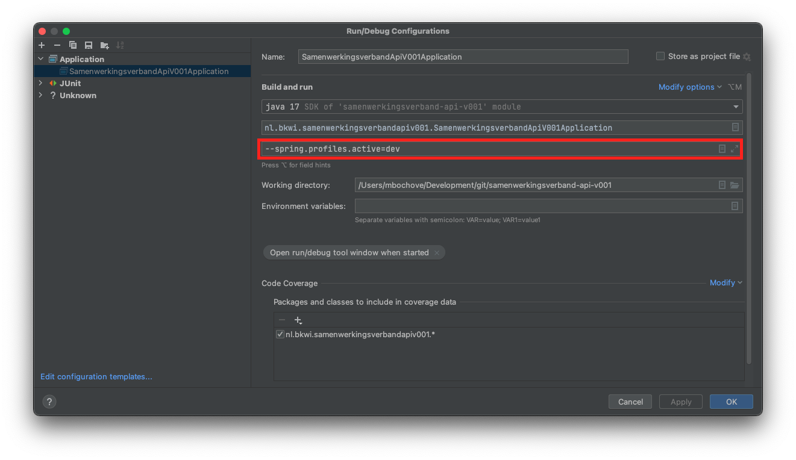
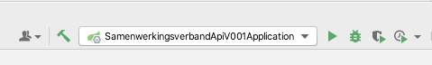
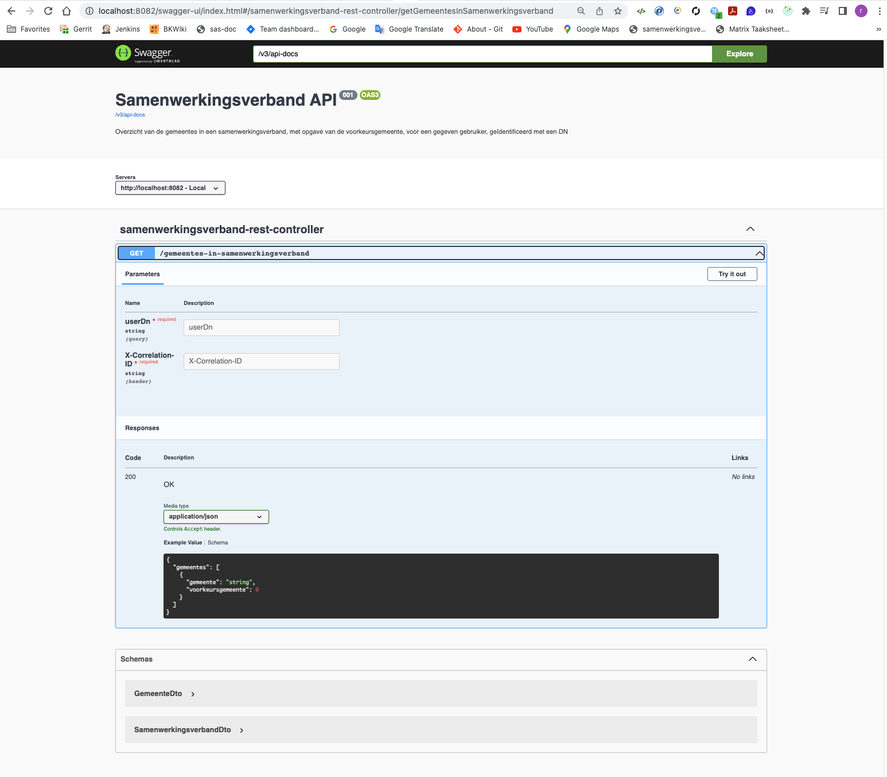
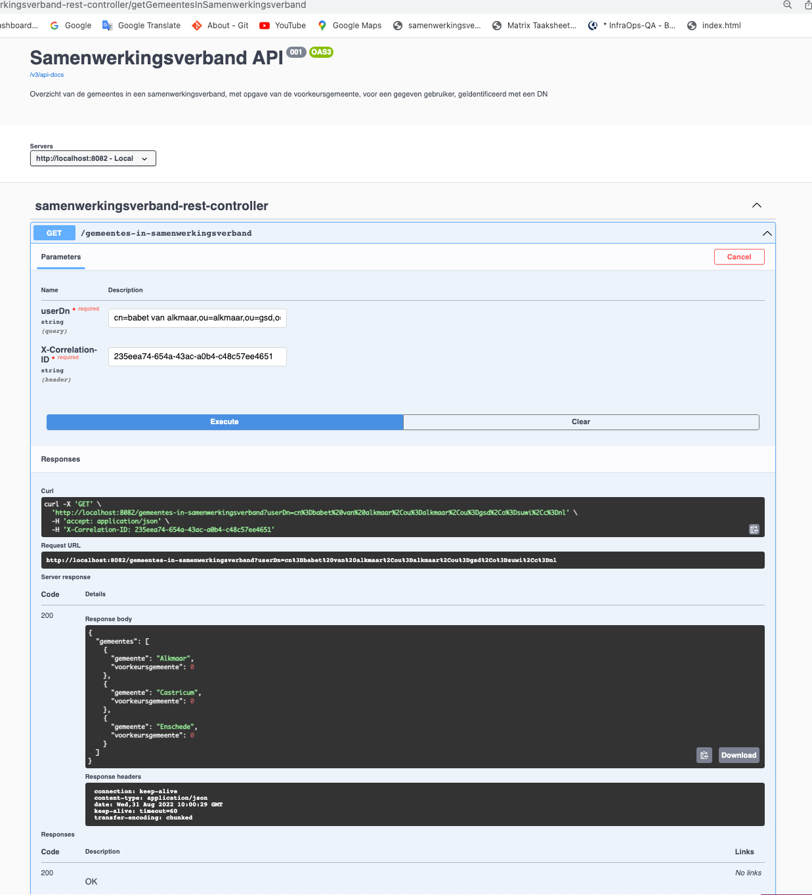
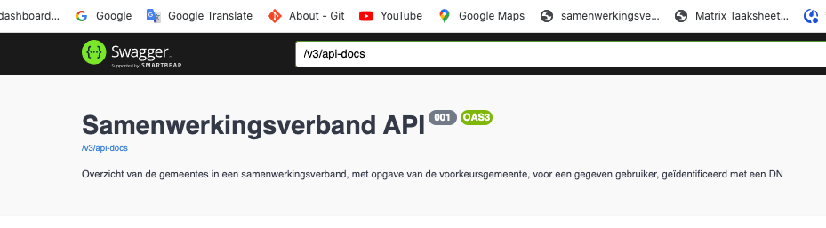
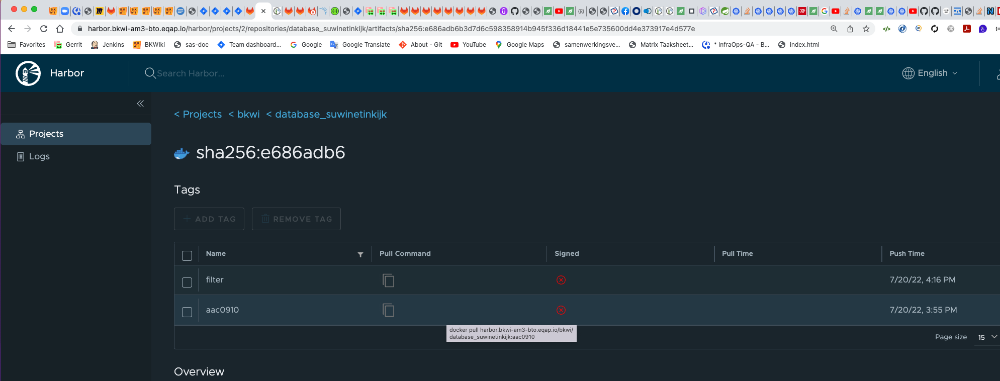
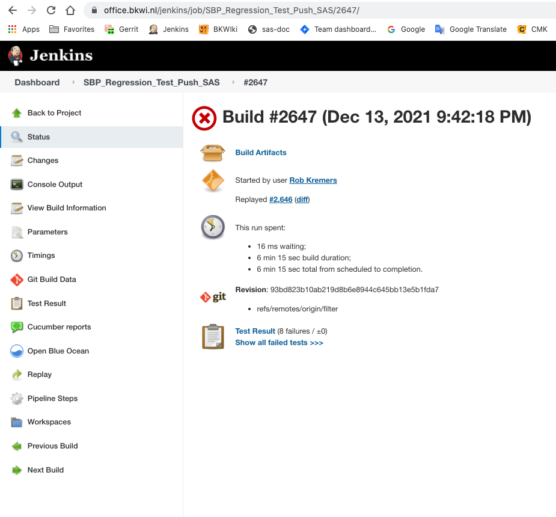
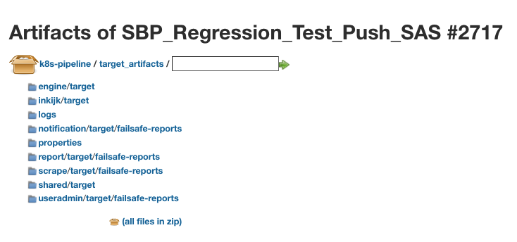

# Implementatie van Spring Boot REST applicatie samenwerkingsverband-api-v001.

[[_TOC_]]

## Introductie

In Suwinet Inkijk (SI) Upgrade moet het volgende geïmplementeerd worden:
- de 1Login functionaliteit, geport van SI Classic
- het tonen van de voorkeursgemeente indien aanwezig.

T.b.v. van de opzet van de applicatie in Gitlab en connectie met SI Upgrade wordt overleg gepleegd met InfraOps.
Gesproken wordt met name met Gert Jan Kersten.

De configuraties betreffende 1Login en de voorkeursgemeente zijn aanwezig in respectievelijk databases / tabellen
**USERADMIN.gemeente_participatie** en **SUWINETINKIJK.profile**.

De content in die database wordt exposed via de geïmplementeerde REST applicatie [samenwerkingsverband-api-v001](https://gitlab.bkwi.nl/bp/pm/ba/services-inkijk/samenwerkingsverband-api-v001).

De functionaliteit van [samenwerkingsverband-api-v001](https://gitlab.bkwi.nl/bp/pm/ba/services-inkijk/samenwerkingsverband-api-v001)
wordt exposed via een contract.  
Dit contract is via Swagger opgezet (OpenAPI v3).  
Dit is geïmplementeerd in Gitlab project [samenwerkingsverband-contract](https://gitlab.bkwi.nl/bp/pm/ba/services-inkijk/samenwerkingsverband-contract).

De functionaliteit wordt uiteindelijk aangeroepen in Suwinet Inkijk (SI) Upgrade.  
Daartoe wordt [samenwerkingsverband-contract](https://gitlab.bkwi.nl/bp/pm/ba/services-inkijk/samenwerkingsverband-contract)  
geïmporteerd in het sas-project:
- /sas/inkijk/webapp/pom.xml
```xml
      <dependency>
        <groupId>nl.bkwi.samenwerkingsverband</groupId>
        <artifactId>contract</artifactId>
        <version>1.0.1</version>
      </dependency>
```

## Beschrijving functionaliteit

### De 1Login functionaliteit

Dit betreft de mogelijkheid voor de gebruiker om aan te geven of het uit te voeren werk voor een bepaalde
gemeente moet gebeuren indien de gebruiker binnen een samenwerkingsverband voor een uitvoerende organisatie 
werkzaam is.

Een uitvoerende organisatie binnen een samenwerkingsverband is een organisatie waaraan door andere organisaties binnen
het samenwerkingsverband (een deel van) de taken van die andere organisaties uitbesteed zijn.

Als een gebruiker inlogt moet bij het aanklikken van een taak het volgende gebeuren:
- Tussenscherm ter controle op de whitelist handling (zie [beschrijving Whitelist Handling SI Upgrade](./05_Beschrijving_Whitelist_Handling_SI_Upgrade.md)) 
- Tussenscherm t.b.v. 1Login:
  - Indien de gebruiker voor een uitvoerende organisatie werkt moet de organisatie gekozen worden
    waarvoor het werk uitgevoerd wordt.
- Vervolgens wordt naar de taak gegaan en wordt bovenin de GUI aangegeven voor welke organisatie de taak uitgevoerd wordt.

De samenwerkingsverbanden zijn vastgelegd in MySQL database **useradmin**.

### Het aangeven van de voorkeursgemeente

Dit betreft de mogelijkheid in SI Classic om aan te geven wat de voorkeursgemeente voor de gebruiker is.  

Als de tussenpagina van 1Login verschijnt zal deze standaard de voorkeursgemeente aangeven. Natuurlijk is het nog 
steeds mogelijk om een andere gemeente te kiezen.

De voorkeursgemeente is vastgelegd in MySQL database **suwinetinkijk**.

## Lokale installatie van samenwerkingsverband-api-v001.

Noot:  
Dit is bedoeld voor lokaal ontwikkelen.

De applicatie is aanwezig in repository [services-inkijk/samenwerkingsverband-api-v001](https://gitlab.bkwi.nl/bp/pm/ba/services-inkijk/samenwerkingsverband-api-v001)

Installeer als volgt:
- Kies een geschikte directory of maak er één aan.
- e.g.:
  ```shell
  $ cd $ws
  $ mkdir workspace1Login
  $ cd workspace1Login
  $ git clone git@gitlab.bkwi.nl:bp/pm/ba/services-inkijk/samenwerkingsverband-api-v001.git
  $ cd samenwerkingsverband-api-v001
  ```
- Check the branches op de commandline:
  ```shell
  $ git branch --all
  * master
  remotes/origin/AEB-885
  remotes/origin/HEAD -> origin/master
  remotes/origin/acceptatie
  remotes/origin/master
  remotes/origin/productie
  $ git fetch origin
  $ git checkout -b AEB-885 remotes/origin/AEB-885
  ```
Je bent nu in de feature branch AEB-885 van de applicatie.

Het sturen van een commit naar Gitlab gaat als volgt:
  ```shell
  $ git add .
  $ git commit -m "AEB-885: Initial Commit"
  # First time a commit is pushed against this feature branche:
  $ git push --set-upstream origin AEB-885
  # For pushing followup commits against this feature branche:
  $ git push
  ```

## Implementatie van de Spring Boot REST applicatie samenwerkingsverband-api-v001

### Exposure

De applicatie wordt via Swagger / OpenAPI 3.0 exposed:
- http://localhost:8080/swagger-ui.html
- http://localhost:8080/swagger-ui/index.html?configUrl=/v3/api-docs/swagger-config

Verder kan de applicatie ook direct aangeroepen worden:
- http://localhost:9090/gemeentes-in-samenwerkingsverband/?userDn=<DN>
  - Voorbeeld van een Distinguished Name (DN):
    - **cn=babet van alkmaar,ou=alkmaar,ou=gsd,o=suwi,c=nl**

De applicatie is readonly en bevat alleen een GET exposure.

### Implementatie functionaliteit

#### Logica

De input van de REST exposure is een Distinguished Name (DN).  
- Voorbeeld:
  - **cn=babet van alkmaar,ou=alkmaar,ou=gsd,o=suwi,c=nl**
- De functionaliteit extraheert hieruit de naam van de gemeente, in dit geval **alkmaar** (in lowercase).
- Deze waarde wordt gebruikt om database.tabel **USERADMIN.gemeente_participatie** uit te lezen.  
- De organisaties in het samenwerkingsverband worden geretourneerd.  
- Indien in de lijst van organisaties geen samenwerkingsverband aanwezig is dan wordt niets geretourneerd.

- In database.tabel ***SUWINETINKIJK.profile** wordt voor de DN en **Samenwerkingsverband.voorkeursgemeente** 
  uitgelezen of een voorkeursgemeente geconfigureerd is en zo ja welke.
- In de lijst van organisaties van het samenwerkingsverband wordt aangegeven welke organisatie de voorkeursgemeente is.

De samenwerkingsverbanden en voorkeursgemeentes wordt geconfigureerd via SI Classic.

#### Uitlezen van de datasources

Zoals tijdens de introductie vermeld wordt content uitgelezen uit respectievelijk databases / tabellen
**USERADMIN.gemeente_participatie** en **SUWINETINKIJK.profile**.

De JPA query voor het uitlezen van **USERADMIN.gemeente_participatie**.
Inclusief de selectie voor een onderdeel (GSD, WGS, Burgerzaken, GB).

```sql
select gp1.naam
from   gemeente_participatie gp1
where  gp1.samenwerkingsverband_id IN
       (
         select s1.id
         from samenwerkingsverband s1
         where s1.onderdeel = :onderdeel
           and s1.id = gp1.samenwerkingsverband_id
       )
  and gp1.samenwerkingsverband_id IN
      (
        select gp2.samenwerkingsverband_id
        from   gemeente_participatie gp2
        where  gp2.uitvoerend = 1
          and  gp2.naam = :naam
          and  gp2.begin <= CURDATE()
          and  (gp2.eind is NULL or gp2.eind >= CURDATE() )
      )
  and    gp1.type_organisatie = 'GEMEENTE'
group  by gp1.naam
order  by gp1.naam
```

De JPA query voor het uitlezen van **SUWINETINKIJK.profile**.

```sql
select p.value
from   profile p
where  p.context = :userDn
and    p.name = 'Samenwerkingsverband.voorkeursgemeente'
;
```

#### Gebruik van profiles

Voor het vastleggen van properties wordt in applicatie **samenwerkingsverband-api-v001** gebruik gemaakt van:
- application.yml
- application-dev.yml
  - Hierin worden properties gezet voor lokaal gebruik.
  - Gebruik hiervoor in de standaard application configuration:
    - Build and run: **--spring.profiles.active=dev**

Onder andere wordt hier server.port=8082 gezet om een conflict met Suwinet Inkijk Upgrade (http://localhost:8080/inkijk)
te vermijden.

#### Uitvoering

- Start de applicatie met dev profile
  - Specificeer dit in **Edit Configurations**
    - Application
      - SamenwerkingsverbandApiV001Application
        - Specify parameter to run with dev profile
          - 
          - Build and run: -Dspring.profiles.active=dev
    - Of: Spring Boot
      - SamenwerkingsverbandApiV001Application
        - VMOption: -Dspring.profiles.active=dev
  - Zie in IntelliJ GUI
    - 
  - Click the icon next to **SamenwerkingsverbandApiV001Application.
- In een browser:
  - http://localhost:9090/gemeentes-in-samenwerkingsverband/?userDn=cn=babet%20van%20alkmaar,ou=alkmaar,ou=gsd,o=suwi,c=nl

#### Resultaat

```json
[
  {
    "gemeente": "Alkmaar",
    "voorkeursgemeente": 0
  },
  {
    "gemeente": "Castricum",
    "voorkeursgemeente": 1
  },
  {
    "gemeente": "Enschede",
    "voorkeursgemeente": 0
  }
]
```

De uitvoering baseert op een specifieke application*.yml file.  
De application*.yml files zijn, indien noodzakelijk, aanwezig in:
- samenwerkingsverband-api-v001/src/main/resources/config/
  - application.yml
  - application-test.yml
- samenwerkingsverband-api-v001/src/test/resources/

De standaard configuratie file voor de applicatie is **application.yml**.  
Deze wordt gebruikt om in de applicatie een bepaalde set configurationele parameters te gebruiken. Hierbij
zal een **application-<situation>.yml** de gegevens van de standaard file **application.yml** overschrijven dan wel
aanvullen. Het gebruik van deze files wordt het toepassen van een gegeven **profile** genoemd. Dit kan op twee manieren:
- via de (IntelliJ) configuratie zoals boven aangegeven.
- command line

Voorbeeld van een command line setting:
```shell
$ java -jar -Dspring.profiles.active=prod application.jar

$ java -jar application.jar --spring.profiles.active=prod
```
Noot:
In de bouwstraat zal de command line setting uitgevoerd worden.

#### Swagger dependency

Ten behoeve van Swagger is in pom.xml toegevoegd:
```xml
<!-- https://mvnrepository.com/artifact/org.springdoc/springdoc-openapi-ui -->
<dependency>
  <groupId>org.springdoc</groupId>
  <artifactId>springdoc-openapi-ui</artifactId>
  <version>1.6.6</version>
</dependency> 
```

Vervolgens is class nl.bkwi.samenwerkingsverbandapiv001.config.OpenApiConfig geïmplementeerd via welke de Swagger API
documentatie geconfigureerd wordt. Hiermee is Swagger / OpenAPI 3.0 geïmplementeerd.  

Noot:  
springdoc-openapi-ui supports OpenAPI 3.0. Dit is de laatste versie van de OpenAPI specificatie.
Een andere library, springfox-swagger, supports alleen OpenAPI 2.0.

Bij uitvoering van Gitlab project [samenwerkingsverband-api-v001](https://gitlab.bkwi.nl/bp/pm/ba/services-inkijk/samenwerkingsverband-api-v001)
kan dit als volgt aangeroepen worden:
- In development mode:
  - ```http://localhost:8082/swagger-ui/index.html```
- In production mode:
  - ```http://localhost:8080/swagger-ui/index.html```

#### Test van het contract via Swagger.

Bij gebruik van bovengenoemde url wordt het volgende zichtbaar:



Click hier op button **Try it out**.

Vul vervolgens in in veld:  
- **userDn**: **cn=babet van alkmaar,ou=alkmaar,ou=gsd,o=suwi,c=nl**.
- **X-Correlation-ID**: **235eea74-654a-43ac-a0b4-c48c57ee4651**

En druk op knop **Execute**.

Het volgende wordt nu zichtbaar:




#### OpenAPI 3.0 contract implementatie

Het contract, dat via Swagger exposed wordt kan in json-vorm gedownload worden.  
Click in het bovengenoemde Swagger scherm of **/v3/api-docs**:

.

De volgende json-file is nu zichtbaar:

```json
// 20220407151249
// http://localhost:8080/v3/api-docs

{
  "openapi": "3.0.1",
  "info": {
    "title": "Samenwerkingsverband API",
    "description": "Overzicht van de gemeentes in een samenwerkingsverband, met opgave van de voorkeursgemeente, voor een gegeven gebruiker, geïdentificeerd met een DN",
    "version": "001"
  },
  "servers": [
    {
      "url": "http://localhost:8080",
      "description": "Local"
    }
  ],
  "paths": {
    "/gemeentes-in-samenwerkingsverband": {
      "get": {
        "tags": [
          "samenwerkingsverband-rest-controller"
        ],
        "operationId": "getGemeentesInSamenwerkingsverband",
        "parameters": [
          {
            "name": "userDn",
            "in": "query",
            "required": true,
            "schema": {
              "type": "string"
            }
          }
        ],
        "responses": {
          "200": {
            "description": "OK",
            "content": {
              "application/json": {
                "schema": {
                  "$ref": "#/components/schemas/SamenwerkingsverbandDto"
                }
              }
            }
          }
        }
      }
    }
  },
  "components": {
    "schemas": {
      "GemeenteDto": {
        "type": "object",
        "properties": {
          "gemeente": {
            "type": "string"
          },
          "voorkeursgemeente": {
            "type": "integer",
            "format": "int32"
          }
        }
      },
      "SamenwerkingsverbandDto": {
        "type": "object",
        "properties": {
          "gemeentes": {
            "type": "array",
            "items": {
              "$ref": "#/components/schemas/GemeenteDto"
            }
          }
        }
      }
    }
  }
}
```

Het bovenstaande contract is geïmplementeerd in Gitlab project [samenwerkingsverband-contract](https://gitlab.bkwi.nl/bp/pm/ba/services-inkijk/samenwerkingsverband-contract).
Op basis hiervan wordt dan de content van het project gegenereerd.

Dit project dient als dependency in sas en in project https://gitlab.bkwi.nl/bp/pm/ba/services-inkijk/samenwerkingsverband-api-v001.  

Noot:  
In dit project zijn de classes **GemeenteDto** en **SamenwerkingsverbandDto** gegenereerd.
Vervolgens zijn deze classes uit **samenwerkingsverband-api-v001** zelf verwijderd.  
De aanmaak van de classes is dus een kip-ei verhaal.

## Opzet van een externe integratietest.

Integratietests worden lokaal uitgevoerd.  
De functionaliteit van de integratietest kan lokaal in een separaat project geïmplementeerd worden.  
Dit kan in het bestaande project **regression-test** of in een nog te bouwen project, dat dan in Gitlab geplaatst
worden zou.  
Voorlopig zal de functionaliteit in **regression-test** geplaatst worden.

Algemene opzet:
- URL: 
  - http://localhost:9090/gemeentes-in-samenwerkingsverband/?userDn=cn=babet%20van%20alkmaar,ou=alkmaar,ou=gsd,o=suwi,c=nl
    - Situatie waarbij het samenwerkingsverband zelf geen gemeente betreft en uitvoerend is.  

- In de integratietest wordt de URL aangeroepen via RestAssured en wordt voor specifieke situaties
  het resultaat gecontroleerd.
- In databases **useradmin** en **suwinetinkijk** wordt de benodigde additionele content toegevoegd.
  - De database zal normaliter als onderdeel van SI Upgrade exposed worden, maar is tevens lokaal beschikbaar.

## De test data

De voor ons relevante test data wordt in de databases useradmin en suwinetinkijk geplaatst.  
De data is opgeleverd via een sas-release.

## Opzetten van dockerized database containers in Gitlab

### Introductie

De op te leveren database containers zullen dienen als stub voor de ontwikkelomgeving. De integratie-tests
zullen hiertegen uitgevoerd worden in de ontwikkelomgeving.
Voor Gitlab / Kubernetes is dat: 

- context: dxc-am3-bto
- namespace: services-inkijk-development

Noot:
Voor BTO en KIT zal gewoon met de reeds aanwezige databases contact gemaakt worden.  
In BTO zullen de integratie-tests eveneens uitgevoerd worden moeten, dus de test-data zal daar eveneens in 
aanwezig zijn moeten.

### Algemene achtergrond:

- https://gitlab.bkwi.nl/bkwi/beheer/infraops/ontwikkeltooling/gitlab-ci
  - Documentatie van InfraOps, bijgehouden door Gert Jan Kersten

### De test data

De test data is in detail aanwezig in [Overzicht test data ten behoeve van integratietests](12_Database_test_data_tbv_integratietests.md)

### Verwachte opzet van de database containers in Gitlab

Geïmplementeerd:
- https://gitlab.bkwi.nl/bp/pm/ba/services-inkijk/database-useradmin
- https://gitlab.bkwi.nl/bp/pm/ba/services-inkijk/database-suwinetinkijk

### Schema om het verband tussen samenwerkingsverband-api-v001 en de databases weer te geven.

[Overview microservice databases](./images/2021_12_13_Overview_microservice_databases_v1.png)

#### Voorbeeld applicatie: splunk-bkwi

https://gitlab.bkwi.nl/bvv/stubs/splunk-bkwi --> dit als template gebruiken in services-inkijk.
https://gitlab.bkwi.nl/bvv/stubs/splunk-bkwi/-/blob/master/kubernetes/base/deployment.yml
- https
- port 3306
- name: $(PROJECT) --> database-useradmin
- image: harbor image reference ?

Alleen die parameters overschrijven, die nodig zijn in deployment.yml

/Users/rkremers/Development/workspace/gitlab-ci/kustomize/deployment.yml


### Het toevoegen van een dockerized database aan het project.

Het doel is hierbij om later de database in de container te kunnen downloaden en beschikbaar te maken voor 
andere functionaliteit, met name [samenwerkingsverband-api-v001](https://gitlab.bkwi.nl/bp/pm/ba/services-inkijk/samenwerkingsverband-api-v001).

In dit geval bestaat de database al:
- $ws/sas/docker/database/**useradmin**/Dockerfile
- $ws/sas/docker/database/**suwinetinkijk**/Dockerfile

De containers worden aangemaakt via $ws/sas/docker/createDockerEnv.sh.  
Verder worden de containers via Gerrit / Jenkins in de repository Harbor geplaatst en zijn hiervandaan te downloaden.

In sas wordt gebruikt:
- $ws/sas/docker/.env

```shell
TAG=filter
REGISTRY=registry-bto.bkwi.nl/bkwi
APPLICATION_PORT=8080
SECURE_PORT=8443
```

https://registry-bto.bkwi.nl/bkwi/harbor  
--> https://registry-bto.bkwi.nl/account/sign-in?redirect_url=%2Fharbor%2Fprojects  
  --> Invalid parameter: redirect_uri  
  --> https://harbor.bkwi-am3-bto.eqap.io/account/sign-in?redirect_url=%2Fharbor%2Fprojects  
    --> https://harbor.bkwi-am3-bto.eqap.io/harbor/projects  

Ze zijn in Harbor dus zijn daar direct te benaderen:  
- https://harbor.bkwi-am3-bto.eqap.io/harbor/projects/2/repositories/database_useradmin  
- https://harbor.bkwi-am3-bto.eqap.io/harbor/projects/2/repositories/database_suwinetinkijk  

Hier kan dan de gewenste commit gekozen worden.

Daarnaast is het mogelijk, dat de databases nog lokaal toegevoegde content bevatten moeten en moeten dan lokaal opnieuw
via het d-script / docker-compose refreshed worden.

Indien b.v. in Harbor database_suwinetinkijk gekozen wordt dan is het volgende zichtbaar:



In Harbor click je dan op het Pull command en verkrijgt het volgende:  
- docker pull harbor.bkwi-am3-bto.eqap.io/bkwi/database_suwinetinkijk:filter

Notabene:  
In Harbor zie je verschillende docker images voor de diverse developer branches.
De onderstaande commando's geven weer wat gedaan worden moet, maar je moet nog steeds zelf bekijken welke docker
image nodig is.

Voor database useradmin:
````shell
# Pull de laatste versie van Harbor.
docker pull harbor.bkwi-am3-bto.eqap.io/bkwi/database_useradmin:aac0910
# Retag de database docker container van harbor naar Gitlab. Dit werkt tegen lokale docker images.
docker tag harbor.bkwi-am3-bto.eqap.io/bkwi/database_useradmin:aac0910 gitlab.bkwi.nl:4567/bp/pm/ba/services-inkijk/database-useradmin:latest
# Push de database docker container naar Gitlab
$ docker push gitlab.bkwi.nl:4567/bp/pm/ba/services-inkijk/database-useradmin:latest

# Situatie lokaal:
$ docker images --digests | grep -i database-useradmin
gitlab.bkwi.nl:4567/bp/pm/ba/services-inkijk/database-useradmin              latest                                                  sha256:f9c38afade9fb181ce9af170b85ea9c98ef90d1cfd2f055d9f283f54f7c9b572   41dc6ecd1823   3 days ago      428MB
````

en voor database suwinetinkijk:
````shell
# Pull de laatste versie van Harbor.
docker pull harbor.bkwi-am3-bto.eqap.io/bkwi/database_suwinetinkijk:aac0910
# Retag de database docker container van harbor naar Gitlab. Dit werkt tegen lokale docker images.
$ docker tag harbor.bkwi-am3-bto.eqap.io/bkwi/database_suwinetinkijk:aac0910 gitlab.bkwi.nl:4567/bp/pm/ba/services-inkijk/database-suwinetinkijk:latest
# Push de database docker container naar Gitlab
$ docker push gitlab.bkwi.nl:4567/bp/pm/ba/services-inkijk/database-suwinetinkijk:latest
````

De docker containers zijn nu aanwezig in: 

https://gitlab.bkwi.nl/bp/pm/ba/services-inkijk/database-useradmin/container_registry

en

https://gitlab.bkwi.nl/bp/pm/ba/services-inkijk/database-suwinetinkijk/container_registry

Vervolgens moet in elk project de pipeline opnieuw gerund worden.

### Alternatieve manier om docker push uit te voeren.

Notabene, dit is bedoeld voor admins.

- In 1Password is aanwezig: HARBOR_CONFIG_JSON
- Maak in ~/.docker/ een subdirectory aan: 
  - mkdir harbor_dxc
  - cd harbor_dxc
- vi harbor_dxc
  - Insert de content van HARBOR_CONFIG_JSON
- export DOCKER_CONFIG=~/.docker/harbor_dxc
- Nu wordt voor 'docker push' de content uit $DOCKER_CONFIG/config.json gebruikt.

## Aanroep van samenwerkingsverband-api-v001 in sas/docker/docker-compose.yml

Voor local development moet **samenwerkingsverband-api-v001** aangeroepen worden kunnen als SI Upgrade opgestart wordt.
Daarvoor is in **sas/docker/docker-compose.yml** het volgende toegevoegd:
- xmysql-suwinetinkijk
- database-suwinetinkijk
  - Waar nodig is deze als afhankelijkheid toegevoegd
- samenwerkingsverband-service
  - Wordt uit Gitlab aangeroepen

Dit laatste is als volgt geïmplementeerd:

```yaml
  samenwerkingsverband-service:
     image: "gitlab.bkwi.nl:4567/bp/pm/ba/services-inkijk/samenwerkingsverband-api-v001:latest"
     expose:
       - "8080"
     ports:
       - "9090:8080"
     depends_on:
       - database-useradmin
       - database-suwinetinkijk
```

Noot:
**sas/docker/docker-compose.yml** wordt gegenereerd door **sas/docker/createDockerEnv.sh**, dus eigenlijk is het 
daarin geïmplementeerd.

**sas/docker/docker-compose.yml** is vervolgens gekopieerd naar **regression-test/scripts/docker-compose.yml**.
Hierbij is er rekening mee gehouden, dat openam niet aanwezig is.

#### Verdere werkzaamheden

regcred-bkw-gitlab.yml wordt eenmalig uitgevoerd voor de bovengenoemde namespaces: jenkins-bkwi-worker-001 / 005
- Dus niet in het project.
- Zal Gert Jan doen.
  - Zal met Danny afgesproken worden als nieuwe namespaces uitgerold worden.


## Uitvoeren van tests

### De uitvoering van tests met sas en samenwerkingsverband-api gecombineerd

```shell
d -dd
d -d
d -dt
# 2021-12-20: de volgende stap is nu niet meer nodig, omdat sas/docker/docker-compose.yml met daarin 
# e samenwerkingsverband-service naar regression-test/scripts/docker-compose.yml gekopieerd is.
d -du
docker restart inkijk_samenwerkingsverband-service_1

# Detail opstart van d -dt:

Wil je je eigen Docker omgeving bouwen (B) of een door jenkins gebouwde Docker omgeving ophalen (O)?
Enter [B/O] : B

Is onderstaande commit de commit die je in docker wilt bouwen?
a5eea2e075  2021-11-30  15:46:02  Marnix Bochove            AEB-847-ALL-TASKS
Enter [j]/n : j

Wil je Splunk meenemen in de docker omgeving?
Enter j/[n] : n
Prepairing Docker...
a5eea2e075  2021-11-30  15:46:02  Marnix Bochove            AEB-847-ALL-TASKSa5eea2e <-- Docker tag
Wacht 5 seconden, druk op enter om door te gaan of druk op 'w' om te wachten
```

De test account:
```shell
dn: cn=Henk VD Handhaven,ou=Dummy Gemeente Veenendaal,ou=gsd,o=suwi,c=nl
objectclass: top
objectclass: person
objectclass: inetOrgPerson
objectclass: organizationalPerson
uid: veenendaal_handhaven
givenName: Henk VD
sn: Handhaven
businessCategory: BASIS_GSD
businessCategory: R1
businessCategory: FR0406001
userPassword: test
createTimestamp: 20010501221501Z
ds-pwp-last-login-time: 20401110090807
pwdChangedTime: 20401110090807.654Z
mail: veenendaal_handhaven@bkwi.nl
```

Speciale test BSN:
- 683938861

```shell
# Indien het nodig is om alle containers te verwijderen:
docker rmi -f $(docker images -a -q)

# Indien het nodig is om alle docker images te verwijderen:
docker image prune -a --filter "until=1h"

# Indien het nodig is om een specifieke docker image te verwijderen:
$ docker image ls | grep -i samenwerkingsverband
$ docker image rm -f 32a70c31e7d8
```

### Het vastleggen van de gemeentenaam in de logging in geval van een samenwerkingsverband

Het is een vereiste, dat in geval van de inlog account werkzaam is voor een samenwerkingsverband
de voorkeursgemeente gelogd wordt.  
Dit gebeurt in sas-module inkijk-webapp; class InkijkService.java.

Om dit te volgen dient het volgende uitgevoerd te worden:
```shell
$ docker exec -it inkijk_webapp-inkijk-server_1 /bin/sh
bash-5.1# cd logs
bash-5.1# tail -f inkijk-raadplegingen-persoon-filter-SNAPSHOT-raadpleegpersoon_v5.log

# Uitvoering van test met account veenendaal_handhaven voor BSN 683938861 en voorkeursgemeente Renswoude.

# Whitelist escape: reden opvraging: Inkomsten van 16 en 17 jarigen
5,c4b312a1-dde0-4140-9034-5dc4e1332488,9f4996d4-9451-4ae3-b0a6-b5b5e9f88c69,2022-01-03,16:31:20.641,veenendaal_handhaven,Henk VD Handhaven,BASIS_GSD&FR0406001&R1,99999991812237118000,99999991812237118000,0406-dummy-handhaven,bsn=683938861,Dummy+Gemeente+Veenendaal,,,Inkomsten van 16 en 17 jarigen
# Selecteer gemeente in het Samenwerkingsverband: Renswoude. Hierbij verwijst OIN 99999991812237118000 naar "Dummy Gemeente Veenendaal", uitvoerende gemeente voor Renswoude.
5,546f2e7f-e153-4188-854c-25cd0d5528e6,9f4996d4-9451-4ae3-b0a6-b5b5e9f88c69,2022-01-03,16:32:24.822,veenendaal_handhaven,Henk VD Handhaven,BASIS_GSD&FR0406001&R1,99999991812237118000,Renswoude,0406-dummy-handhaven,,Dummy+Gemeente+Veenendaal,,,

# Verder overzicht van Ralph betreffende de diverse test situaties.
#Scenario 1: Gebruiker van gemeente die niet in een samenwerkingsverband zit, OIN 00000001810237118000 van de gemeente van de gebruiker wordt 2x in de log geplaatst.
5,c1649b6c-0fb6-499e-b90d-9cb8ffdec41e,1a9e4f42-0b26-4698-a67e-4ed743c43de4,2021-12-23,10:22:20.41,developer,developer,B002&BASIS_BKWI&FR1000&FR1001&FR1003&FR1004&FR1005&FR1006&FR1007&FR1008&FR1009&FR1010&FR1011&FR1012&FR1013&FR1014&FR1015&FR1016&FR1017&FR1018&FR1019&FR1020&FR1021&WE_BKWI,00000001810237118000,00000001810237118000,bkwi-showcase,bsn=768510338,,,,

#Scenario 2: Gebruiker van gemeente met OIN 99999991812237118000 die in een samenwerkingsverband zit, met BSN in de whitelist, gekozen gemeente in samenwerkingsverband is Rhenen, dossier id is 06a7137e-c189-4789-9d05-aaf80bce585a.
5,3f770e21-f531-4183-a11f-f4d548bf1685,06a7137e-c189-4789-9d05-aaf80bce585a,2021-12-23,10:28:11.376,veenendaal_handhaven,Henk VD Handhaven,BASIS_GSD&FR0406001&R1,99999991812237118000,99999991812237118000,0406-dummy-handhaven,bsn=768510338,Dummy+Gemeente+Veenendaal,,,
5,57075b6a-dbab-4589-b8e5-314ded7e280f,06a7137e-c189-4789-9d05-aaf80bce585a,2021-12-23,10:28:19.329,veenendaal_handhaven,Henk VD Handhaven,BASIS_GSD&FR0406001&R1,99999991812237118000,Rhenen,0406-dummy-handhaven,,Dummy+Gemeente+Veenendaal,,,

# Scenario 3: Gebruiker van gemeente met OIN 99999991812237118000 die in een samenwerkingsverband zit, met BSN NIET in de whitelist, reden van opvraging is Terugvordering derden, gekozen gemeente in samenwerkingsverband is Renswoude, dossier id is dfb10e39-ff7b-4c93-8ffa-be062e0b67ca.
5,35ca1d33-ab5b-4379-966f-d732ea70ce45,dfb10e39-ff7b-4c93-8ffa-be062e0b67ca,2021-12-23,10:29:14.2,veenendaal_handhaven,Henk VD Handhaven,BASIS_GSD&FR0406001&R1,99999991812237118000,99999991812237118000,0406-dummy-handhaven,bsn=683938861,Dummy+Gemeente+Veenendaal,,,Terugvordering derden
5,33b9103a-5a8a-4220-a93f-c0531e24f578,dfb10e39-ff7b-4c93-8ffa-be062e0b67ca,2021-12-23,10:29:26.903,veenendaal_handhaven,Henk VD Handhaven,BASIS_GSD&FR0406001&R1,99999991812237118000,Renswoude,0406-dummy-handhaven,,Dummy+Gemeente+Veenendaal,,,
```

Het bovenstaande kan in de toekomst voor een Splunk rapportage uitgelezen worden.

### Controle van data in de databases

De databases, b.v. useradmin en suwinetinkijk worden voor ontwikkeldoeleinden gevuld met behulp van sql-scripts,
aanwezig in:
- /$ws/sas/services/
  - suwinetinkijk/mysql/
  - /useradmin/mysql/
  - etc.

#### Controle van de scripts bij lokaal gebruik

Na implementatie moeten deze uitgevoerd worden om te zien of de scripts succesvol zijn:

```shell
# Uitvoer van de sql-scripts in unix.
$ d -d
# Tijdens de uitvoering controleren of scripts een foutmelding genereren.
# Vervolgens lokaal inloggen om de database tabel inhoud te controleren.
$ mysql -u root -p
Enter password: vagrant

mysql> show databases;
+--------------------+
| Database           |
+--------------------+
| information_schema |
| account            |
| bbr                |
| broker             |
| brokeradmin        |
| codelist           |
| correctie          |
| dossier            |
| enquete            |
| mysql              |
| notification       |
| performance_schema |
| postcode           |
| report             |
| sbrquery           |
| suwinetinkijk      |
| suwirdw            |
| sys                |
| useradmin          |
+--------------------+
19 rows in set (0.07 sec)

# Controle
mysql> use useradmin;

select * from gemeente_participatie;
select * from samenwerkingsverband;
```

#### Controle van de scripts in de docker container

Als voorbeeld wordt de docker container voor database useradmin genomen.

```shell
# Starten van de applicatie. Zie ook: https://office.bkwi.nl/sas/sas-documentation/inkijk/deployment_SI_Upgrade.html
# Voor de specifieke situatie van 1Login:
$ d -du -diu -dsu

# In een tweede terminal:
$ docker container ls | grep -i useradmin
# Kies container inkijk_database-useradmin_1
$ docker container exec -it inkijk_database-useradmin_1 /bin/bash
# Creëer de volgende symbolic link:
bash-4.2# ln -s  /var/lib/mysql2/mysql.sock /var/lib/mysql/mysql.sock
# Inloggen in de database useradmin IN DEZE CONTAINER.
bash-4.2# mysql -u root -p useradmin
Enter password: vagrant

# Controle
mysql> use useradmin;

select * from gemeente_participatie;
select * from samenwerkingsverband;
```

Belangrijk is, het bouwproces in de Gerrit / Jenkins bouwstraat te begrijpen.  
Als een feature branch gemerged wordt naar de developer branch dan zal de developer branch opnieuw gebuild worden.

Daarbij kan het mogelijk fout gaan.
Je ziet dan in Mattermost publieke kanaal van het developer team een waarschuwing:

```shell
build_results_bot
BOT
4:01 PM

@here :sos: :computer: Waarschuwing: er is een fout opgetreden bij het bouwen van de filter branch
```

In dat geval moet het bovenstaande herhaald worden om de uiteindelijke database inhoud te controleren.  
Uiteraard moet ook de hele situatie bekeken worden: die is nu niet consistent meer.


### Resultaten van tests in de Jenkings bouwstraat

Indien het nodig is om in Jenkins de artifacten te bekijken van gefaalde regression-test dan kan dit hier
voor een gegeven test run (in dit geval #2647):
- https://office.bkwi.nl/jenkins/job/SBP_Regression_Test_Push_SAS/2647/artifact/k8s-pipeline/target_artifacts/engine/target/screenshots/regression/

Voor de duidelijkheid wordt in de onderstaande screenshot weergegeven hoe hiernaartoe te navigeren:
- Click op **Build Artifacts**



#### Analysis of the results

- In general one can click on **Console Output** and the detailed logging is available.
  - The failed tests will be available in this logging.
  - They will also be separately listed under **Test Result**.
- For more details click on **Build Artifacts**.

The following will be visible:



Several reports will be given.  
Also under **logs** the content of the logging of the various docker containers will be visible.  
This is not (always) present in the general logging under **Console Output**.  
This is especially important if the docker container logging needs to be compared with the local docker container logging.

## Opzet van een bouwstraat

De aanroep van het image van samenwerkingsverbandapi-v0100 is in **$ws/sas/docker/docker-compose.yml** geplaatst.
In deze opzet zijn tevens de dockerized databases useradmin en suwinetinkijk aanwezig, die dan direct door 
samenwerkingsverbandapi-v0100 aangesproken worden kunnen.

```yaml
  samenwerkingsverband-service:
     image: "gitlab.bkwi.nl:4567/bp/pm/ba/services-inkijk/samenwerkingsverband-api-v001:latest"
     expose:
       - "8080"
     ports:
       - "9090:8080"
     depends_on:
       - database-useradmin
       - database-suwinetinkijk
```

- Een image van Gitlab zal
  - OF uit de Gitlab registry gehaald moeten worden (misschien voorlopig voor ontwikkeldoeleinden)
  - OF geforward worden moeten uit de Gitlab registry naar Harbor. Dit kan geautomatiseerd worden.
  - De tweede optie verdient uiteraard de voorkeur.

### Docker Image van GitLab
Om een door gitlab gebouwd docker image te kunnen gebruiken moet er een aantal dingen gebeuren. Je lokale docker moet
namelijk weten hoe hij bij de GitLab docker registry kan komen. In Gitlab is er voor elk project een eigen url
van de docker registry. In Gitlab kan je die vinden door naar project 'samenwerkingsverband-api-v001' te gaan. In het 
menu links ga je naar 'Packages & Registries'/'Container Registry' te gaan. Je ziet dan dat we 1 image registry hebben. 
De url van deze registry kan je kopieren naar clipboard, want die heb je nodig in het docker login commando.
Voordat je met docker login kan inloggen op deze registry moet je eerst nog een 'Personal Access Token' maken. Dat doe 
je als volgt:
- Ga in gitlab naar profile menu (rechtsboven)
- Kies Preferences
- Selecteer in menu links 'Access Tokens'
- Vul token name in => bv Docker
- Vul een expiration date in => bv volgend jaar
- Selecteer 'Read registry'
- Druk nu op button 'Create personal access token'
- Kopieer de token naar een veilige plek (bijvoorbeeld naar jouw lokale keepass of 1password applicatie)

Als je nu de url en je token hebt, dan kan je het volgende docker commando geven:

```
$ docker login gitlab.bkwi.nl:4567/bp/pm/ba/services-inkijk/samenwerkingsverband-api-v001 -u <Your Username> -p <Access Token>
```

Als je het laatst gebouwde docker image wil testen, dan doe je dat als volgt:

```
$ docker run gitlab.bkwi.nl:4567/bp/pm/ba/services-inkijk/samenwerkingsverband-api-v001
```

Meer informatie over GitLab en Docker kan je hier vinden:

https://docs.gitlab.com/ee/user/packages/container_registry/


De applicatie samenwerkingsverbandapi-v0100 heeft in Gitlab zijn eigen omgeving en is geen onderdeel van SI Upgrade. 
Daarom zal de commit van samenwerkingsverbandapi-v0100 een andere hash dan die van sas hebben (het waarin SI Upgrade 
geïmplementeerdis).  
Dit zal dan door InfraOps t.z.t. via scripting aangepastworden moeten, omdat anders geen gecoördineerde refresh 
(en start?) plaatsvinden kan.

- in BTO / KIT / Productie:
  - netwerkverbindingen aanpassen.

[back to main](../README.md) |
[previous](./05_Beschrijving_Whitelist_Handling_SI_Upgrade.md) |
[next](./07_Implementatie_functionaliteit_regression_test.md)