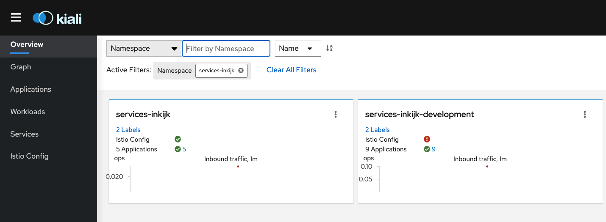
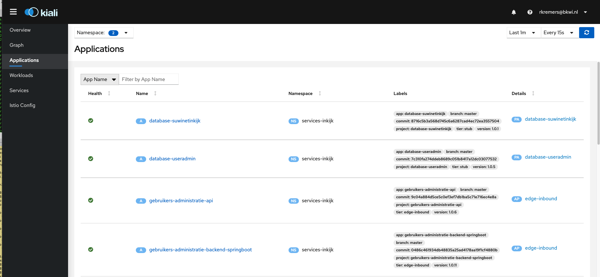
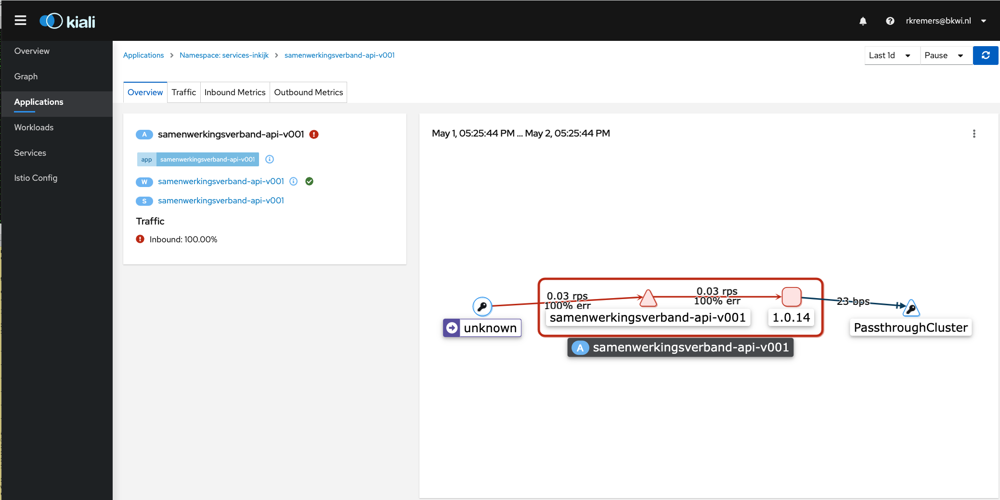
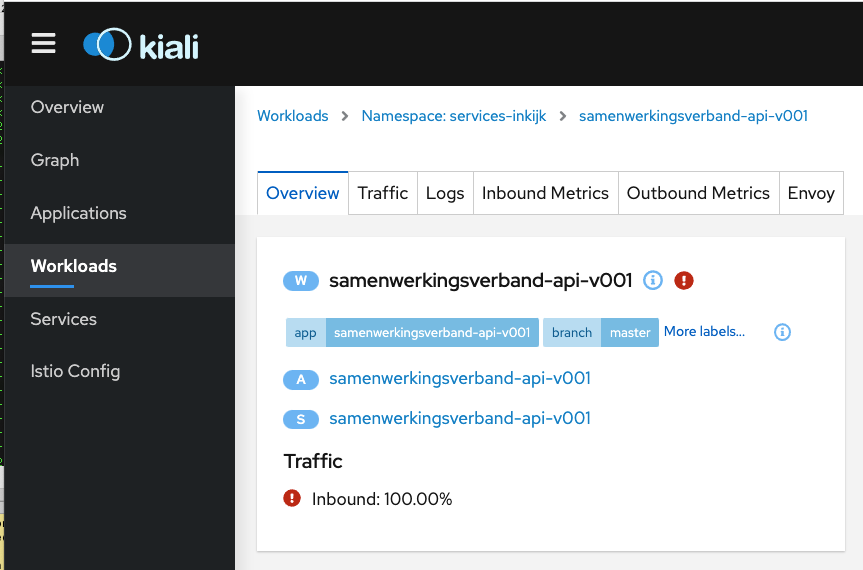
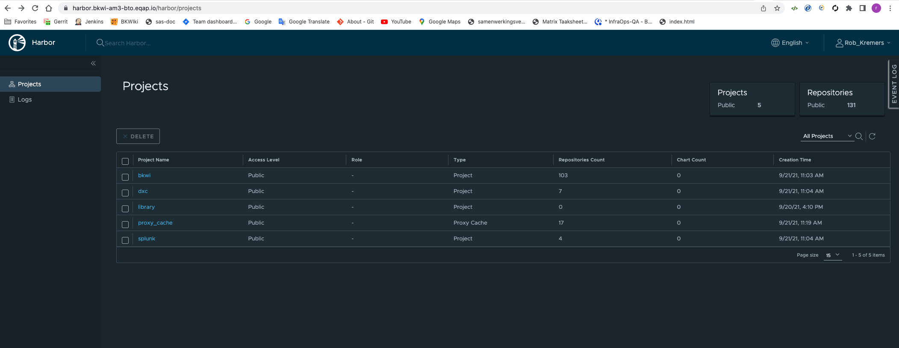
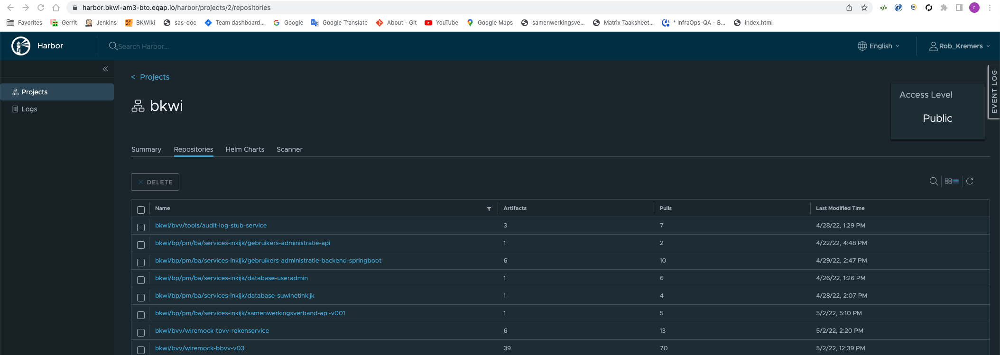
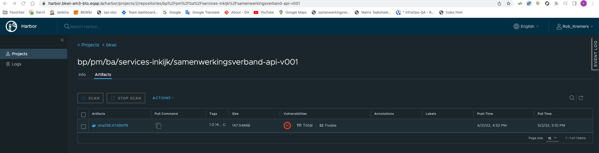

# Overzicht van Gitlab / kubernetes met betrekking tot project 1Login

[[_TOC_]]

## Introductie

In dit hoofdstuk wordt besproken welke stappen uitgevoerd worden moeten om een overzicht van de situatie in de 
Gitlab / Kubernetes bouwstraat te krijgen:
- De verschillende omgevingen
- Overzicht van de applicaties
- Hoe de loggings, etc. te bereiken om een situatie te kunnen analyseren

Deels zijn dit tips & tricks, die toegepast worden om de omgeving en interactie tussen applicatie en omgeving te 
kunnen analyseren.

Noot:
Momenteel wordt de DXC bouwstraat nog geïnstalleerd en we merken, dat verbindingen tussen componenten soms nog niet
mogelijk zijn. Dit hoofdstuk zal dus waar nodig en mogelijk uitgebreid worden.

## De Gitlab / Kubernetes omgeving

### Documentatie

- [DXC: INFRA For Services Inkijk application; Setup the infra part for the Services-Inkijk application](https://dxc-bkwi.gitlab.host/bkwi-transition/vips/-/wikis/Infra/Kub8s/INFRA%20For%20Services-Inkijk%20application#https-ingress-for-services-inkijk)
- [Service Entry](https://istio.io/latest/docs/reference/config/networking/service-entry/#ServiceEntry)
  - Enables adding additional entries into Istio’s internal service registry

### Overzicht van beschikbare servers

In [Serverpark-DXC.xlsx](./documents/Serverpark-DXC.xlsx) wordt een overzicht gegeven van de momenteel beschikbare
servers voor de Gitlab / Kubernetes omgeving.

Om toegang te krijgen tot deze servers moet het volgende gedaan worden:
1. Vermelding in de lokale ~/.ssh/config file.
2. In ~/ssh moet een public key aangemaakt zijn. Deze moet toegevoegd zijn in https://gitlab.bkwi.nl/-/profile/keys van de account
van de gebruiker.

### Inloggen in de servers (tussenserver, BTO-server)

Het inloggen in servers waar de functionaliteit geplaatst is vindt plaats via een tussenserver.  
Reden is, dat de servers, waarop de feitelijke functionaliteit draait, niet direct benaderd worden mogen.

In mijn lokale file ~/.ssh/config staat als tussenserver:

```shell
Host jumpzw
 Hostname 145.21.183.126
 DynamicForward 127.0.0.1:8080
```

```shell
# Tussenserver.
$ ssh jumpzw 

# De server voor BTO
$ ssh amtinkijk01

# Naar de directory gaan waar de sas inkijk.properties file staat om de
# samenwerkingsverband functionaliteit in sas aan of uit te zetten.
$ cd /opt/tomcat/tomcat/conf/suwinet
$ ls -la
total 36
drwxr-xr-x 2 tomcat tomcat 4096 Apr 21 16:05 .
drwxr-xr-x 4 tomcat tomcat 4096 Feb  4 15:05 ..
-rw-r--r-- 1 tomcat tomcat 1626 Apr 21 16:05 inkijk.properties
-rw------- 1 tomcat tomcat   43 Jan  5 04:25 jmxremote.access
-rw------- 1 tomcat tomcat   56 Feb  1 07:12 jmxremote.password
-rwxr-xr-x 1 tomcat tomcat  307 Oct 14  2021 mandatedusers.properties
-rw-r--r-- 1 tomcat tomcat  517 Jan  5 04:24 notification.properties
-rw-r--r-- 1 tomcat tomcat  776 Apr  1 12:45 report.properties
-rw-r--r-- 1 tomcat tomcat 1530 Apr  1 12:45 suwinet-inkijk.properties

# Toggle: 
# Indien deze parameter een waarde bevat, zijnde de url naar samenwerkinsverband, dan is in sas
# de samenwerkingsverband functionaliteit actief.
# inkijk.properties bevat momenteel nog niet de parameter:
inkijkservices.gemeentesInSamenwerkingsverband.url

# Voor BTO:
inkijkservices.gemeentesInSamenwerkingsverband.url=https://services-inkijk.bto.bkwi.local/services-inkijk/samenwerkingsverband-api-v001/
```


## Bouwstraat problemen oplossen

Belangrijk:
Voor het onderstaande script zijn admin rechten in het gitlab-ci project noodzakelijk.  
Momenteel worden die toegekend aan medewerkers van InfraOps.

```shell
https://gitlab.bkwi.nl/bkwi/beheer/infraops/ontwikkeltooling/gitlab-ci
- README.md
	- Aanmaken van een nieuw project
	  - Aantal uit te voeren stappen
	- cd gitlab-ci/scripts
	- ./checkProjects.sh -h

$ sh checkProjects.sh -h
Usage: checkProjects.sh [-d] [-a] [-h] [-r] [-p <project id>] [-H <host>] [-T <token>] [-g <pipelineDefinition>] [-f <filename>]
  with -d: debug mode
       -a: report on all projects
       -x: skip archived projects
       -m: report on missing settings gitlab projects (release process)
       -f: create a fix script for missing settings gitlab projects
           (overrides option -m)
       -h: print help
       -r: grep the reference to gitlab-ci branches in the .gitlab-ci.yml
           and kubernetes/base/kustomization.yml
           (will disable option -m)
       -p: run only for project with id <project id>
       -H: set gitlab host to <host>
           default: gitlab.bkwi.nl
       -T: set token to use to <token>
           default: read from '~/.gitlab/accessToken'
       -g: list the projects using the <pipelineDefinition> pipeline.
           (will disable option -m and -r)

Note:
Voor het uitvoeren van dit script is het volgende nodig:
- ~/.gitlab/accessToken
  - Dient een Gitlab accessToken met de api grant te bevatten.
- De uitvoerder dient momenteel 

./checkProjects.sh -f # fix missing settings. Need to know project id.
- Project id:
	- https://gitlab.bkwi.nl/bp/pm/ba/services-inkijk/gebruikers-administratie-api
		- Under 'gebruikers-administratie-api' you see Project ID: 759.

./checkProjects.sh -p 759 -f fixes/20220225.sh | tee logs/20220225-759.log

--> fixes/20220225.sh

cat fixes/20220225.sh
--> Some fixes

fixes/20220225.sh | tee logs/20220225-759-fixes.log
--> Fixed.

./checkProjects.sh -m # Only a check.

--> One mismatch left. Not relevant.
```

## Opzoeken van ondersteunende applicaties, functionaliteit en logging in Gitlab / Kubernetes

### Introductie

De opgeleverde applicaties, die in Gitlab / Kubernetes aanwezig zijn (in de toekomst ook het sas- en regression-test
project) produceren logging, die op verschillende manieren benaderbaar zijn. Deze methoden worden
hier besproken.

### Applicaties benaderen via https://dxc-bkwi.okta.com/

De verschillende applicaties, die gebruikt worden om in Gitlab / Kubernetes de werking te ondersteunen,
zijn via https://dxc-bkwi.okta.com/ toegankelijk.  
Na inloggen zijn voor BTO en KIT toegankelijk:

| Applicatie  | Omschrijving                                                                                       | Documentatie |
|-------------|----------------------------------------------------------------------------------------------------|--------------|
| Kiali       | Kiali is a management console for Istio service mesh                                               | https://kiali.io/ |
| EQUINIX     | Interconnectivity functionaliteit                                                                  | https://www.equinix.nl/  |
| Prometheus  | free software application used for event monitoring and alerting                                   | https://prometheus.io/  |
| Zipkin     | Zipkin is a Java-based app used for distributed tracing and identifying latency issues             | https://zipkin.io/  |
| Grafana     | Grafana is a multi-platform open source analytics and interactive visualization web application    | https://grafana.com/  |
| Splunk     | Software for searching, monitoring, and analyzing machine-generated data via a Web-style interface | https://www.splunk.com/  |
| Zabbix     | open-source software tool to monitor IT infrastructure such as networks, servers, virtual machines, and cloud services | https://www.zabbix.com/  |

#### Toegang tot Kiali in BTO

In https://dxc-bkwi.okta.com/ wordt Kiali BTO gekozen.

Voor het project 1Login worden de applicaties in namespace **services-inkijk*** geplaatst.
- development: **services-inkijk-development**
- test: **services-inkijk**

Later zullen nog namespaces voor acceptatie (KIT) en productie toegevoegd worden.

Kies nu als als namespace **services-inkijk**.  
Het volgende is nu zichtbaar:



Click nu in de linkerbalk op **Applications**.  
Nu wordt een overzicht van de applicaties in de 2 namespaces **services-inkijk** en **services-inkijk-development** gegeven.
Zie:


Rechtsboven is aangegeven hoe vaak ververst wordt en vanaf welk tijdstip logging meegenomen wordt.  
Kies hier geschikte settings:
- B.v. na een run in de build straat neem je alle logging van het laatste uur.
- Verversing: kies **Pause**

Click op **samenwerkingsverband-api-v001**. Het volgende is nu zichtbaar:


Click op **W samenwerkingsverband-api-v001**. Het volgende wordt nu zichtbaar:


Nu is een tab **Logs zichtbaar**. Als hierop ge-click-ed wordt dan wordt logging zichtbaar van de betreffende pod.  
Er zijn twee typen logging zichtbaar:  
- Amberkleurig: betreft istio-proxy logging.  
- Wit: logging van de applicatie.

Boven de logging zijn aangevinkt:
- istio-proxy  
- samenwerkingsverband-api-v001  

De istio-proxy logging kan uitgevinkt worden. Dit is meta-logging en voor ons normaliter niet relevant.

## Bekijken van kubernetes entiteiten via de command-line.

### Introductie

Via de command-line kunnen de kubernetes entiteiten en eventuele logging eveneens bekeken worden.
In het volgende worden commando's getoond om dit te kunnen doen.

### Command line tools

Referenties:  
- [BVV-documentatie Inwerken Kubernetes](https://gitlab.bkwi.nl/bvv/documentatie/-/tree/master/Inwerken/03_kubernetes)  
  - In het volgende wordt een inleiding in kubernetes via de command-line gegeven:  
- https://github.com/ahmetb/kubectx

Als het bovenstaande bekeken en gevolgd is dan zijn geinstalleerd:  
- kubernetes  
- kubectx  
  - a tool to switch between contexts (clusters) on kubectl faster.
- kubens  
  - a tool to switch between Kubernetes namespaces (and configure them for kubectl) easily.

#### kubectx

```shell
$ kubectx
docker-desktop
dxc-am3-acc
dxc-am3-bto
dxc-am3-prd
dxc-zw1-acc
dxc-zw1-prd
k8s
```

De huidige opzet is:
- Voor development en BTO: **dxc-am3-bto**
- Voor KIT / Acceptatie: **dxc-am3-acc** EN **dxc-zw1-acc**
- Voor productie: **dxc-am3-prd** EN **dxc-zw1-prd**

Dus in geval b.v. een secret in acceptatie of productie nagelopen worden moet dan in beide omgevingen controleren.

Wijzigen:
```shell
$ kubectx dxc-am3-bto
```

#### kubens

```shell
$ kubens
..
kube-node-lease
kube-public
kube-system
services-inkijk
services-inkijk-development
```

Wijzigen:
```shell
$ kubens services-inkijk
```

#### Alias k

Op de command-line zal heel vaak het command **kubectl** gebruikt worden.  
Om dit sneller uit te voeren is in ~/.bash_profile het volgende toegevoegd:

```shell
alias k=kubectl
```

#### Aanwezigheid van pods, services, deployments in de kubernetes omgeving.

Vaak wil men een overzicht van services, pods, deployments, secrets (voor een uitgebreide beschrijving hiervan zie een
kubernetes tutorial).

Hiervoor wordt het volgende uitgevoerd:  
(er zijn uiteraard nog veel meer nuttige k8s commando's)


```shell
$ k get pod,svc,deploy,secret | grep -i samenwerkingsverband
pod/samenwerkingsverband-api-v001-5ccdcc795d-qwjkn               2/2     Running   0          68m
service/samenwerkingsverband-api-v001                 ClusterIP   10.100.22.250    <none>        8080/TCP,15020/TCP   15d
deployment.apps/samenwerkingsverband-api-v001                 1/1     1            1           68m
```

#### Aanwezigheid van secrets in de kubernetes omgeving.

Een secret is een k8s configuratiefile, die niet meteen uitgelezen worden kan. De files zijn base64 encoded.  
Secrets bevatten b.v. de credentials van een database.

```shell
$ k get secrets
NAME                          TYPE                                  DATA   AGE
..
sa-db-1login                  generic                               3      56d
..

# Uitlezen en evt. editen van een secret
$ k edit secret sa-db-1login
# Please edit the object below. Lines beginning with a '#' will be ignored,
# and an empty file will abort the edit. If an error occurs while saving this file will be
# reopened with the relevant failures.
#
apiVersion: v1
data:
  DB_PASSWORD: <password base64 encoded>
  DB_SERVER: <hostname base64 encoded>
  DB_USER: <username base64 encoded>
kind: Secret
metadata:
  creationTimestamp: "2022-06-17T10:56:59Z"
  labels:
    eqap.io/istio: "true"
  name: sa-db-1login
  namespace: services-inkijk
  ownerReferences:
  - apiVersion: bitnami.com/v1alpha1
    controller: true
    kind: SealedSecret
    name: sa-db-1login
    uid: a04b7e87-1ffc-49ec-9355-d556d38da41e
  resourceVersion: "259510962"
  uid: 9c80e11a-c1d5-4d4a-876a-2550efe26f92
type: generic

# Een base64 encoded waarde kan als volgt uitgelezen worden:
$ echo "<encoded value>" | base64 -D

# Als voorbeeld het uitlezen van de hostname mysql.kit.bkwi.local
rkremers@BKWI_C02ZX41RMD6R:k8s (master)$ echo "bXlzcWwua2l0LmJrd2kubG9jYWw=" | base64 -D
mysql.kit.bkwi.localrkremers@BKWI_C02ZX41RMD6R:k8s (master)$

# In het bovenstaande is de hostname zichtbaar achter de standaard terminal info.
# De hostname heeft geen newline en komt daardoor op dezelfde regel.
# STANDAARD FOUT VAN DXC: Ze zetten er een newline achter, zodat de database credentials niet goed uitgelezen worden kunnen.
# Om een property waarde correct te encode wordt de volgende methode gebruikt:
$ echo -n «hostname» | base64
```

#### Aanwezigheid van een service entry in de kubernetes omgeving.

```shell
$ k get se
NAME                   HOSTS                      LOCATION        RESOLUTION   AGE
mysql.kit.bkwi.local   ["mysql.kit.bkwi.local"]   MESH_EXTERNAL   DNS          91d
```

Enables adding additional entries into Istio’s internal service registry. 
Als een service van buitenaf aangesproken worden moet dan wordt hiervoor een service entry opgezet. Dit is het geval
voor het aanspreken van een database.  
In de opzet voor BKWI is het zo, dat de naam van de service-entry gelijk zijn moet aan de hostname van de database.  
Verder zijn er nog meer plaatsen waar dat het geval is. Zie bovenstaande documentatie aan het begin van dit hoofdstuk.  
**Indien dit niet goed opgezet is dan zal dit tot omgevingsfouten leiden.**

Zoals duidelijk is zijn de applicaties voor 1Login en Gebruikersadministratie in dezelfde namespace in dezelfde 
context en namespace aanwezig. **Dit moet nog uit elkaar gehaald worden.**

#### Aantonen, dat in de test omgeving (BTO), met namespace services-inkijk voor sas samenwerkingsverband-api benaderbaar is

Noot:
- Voor het volgende is in samenwerkingsverband-api-v001 de logging op 'DEBUG'

```shell
# Terminal 1:
$ ssh jumpzw 

$ ssh amtinkijk01

# babet
curl -vvv 'https://services-inkijk.bto.bkwi.local/services-inkijk/samenwerkingsverband-api-v001/gemeentes-in-samenwerkingsverband?userDn=cn%3Dbabet%20van%20alkmaar%2Cou%3Dalkmaar%2Cou%3Dgsd%2Co%3Dsuwi%2Cc%3Dnl' \
  -H 'accept: application/json' \
  -H 'X-Correlation-ID: 07eb515f-865b-496d-9560-9ed35d0c4d50' | jq .

# Result:
{
  "gemeentes": [
    {
      "gemeente": "alkmaar",
      "voorkeursgemeente": 1
    },
    {
      "gemeente": "Bergen",
      "voorkeursgemeente": 0
    },
    {
      "gemeente": "Den Helder",
      "voorkeursgemeente": 0
    }
  ]
}


# Nu babet2
curl -vvv 'https://services-inkijk.bto.bkwi.local/services-inkijk/samenwerkingsverband-api-v001/gemeentes-in-samenwerkingsverband?userDn=cn%3Dbabet2%20van%20alkmaar%2Cou%3Dalkmaar%2Cou%3Dgsd%2Co%3Dsuwi%2Cc%3Dnl' \
  -H 'accept: application/json'
{
    "gemeentes": [
        {
            "gemeente": "Alkmaar",
            "voorkeursgemeente": 0
        },
        {
            "gemeente": "Castricum",
            "voorkeursgemeente": 0
        },
        {
            "gemeente": "Enschede",
            "voorkeursgemeente": 0
        }
    ]
}

# Terminal 2:
$ k get pod,svc,deploy | grep -i samenwerkingsverband
pod/samenwerkingsverband-api-v001-5ccdcc795d-qwjkn               2/2     Running   0          33m
service/samenwerkingsverband-api-v001                 ClusterIP   10.100.22.250    <none>        8080/TCP,15020/TCP   15d
deployment.apps/samenwerkingsverband-api-v001                 1/1     1            1           33m

$ k logs samenwerkingsverband-api-v001-5ccdcc795d-qwjkn --tail=1 --follow

2022-05-06 15:32:56.490 DEBUG 1 --- [nio-8080-exec-2] n.b.s.s.SamenwerkingsverbandService      : Overzicht van organisaties aanwezig in het samenwerkingsverband
2022-05-06 15:32:56.490 DEBUG 1 --- [nio-8080-exec-2] n.b.s.s.SamenwerkingsverbandService      : Organisatie: Alkmaar, voorkeursgemeente: 0
2022-05-06 15:32:56.491 DEBUG 1 --- [nio-8080-exec-2] n.b.s.s.SamenwerkingsverbandService      : Organisatie: Castricum, voorkeursgemeente: 0
2022-05-06 15:32:56.491 DEBUG 1 --- [nio-8080-exec-2] n.b.s.s.SamenwerkingsverbandService      : Organisatie: Enschede, voorkeursgemeente: 0
2022-05-06 15:33:23.122 DEBUG 1 --- [io-8080-exec-10] b.s.s.SamenwerkingsverbandRestController : userDn = cn=babet van alkmaar,ou=alkmaar,ou=gsd,o=suwi,c=nl
2022-05-06 15:33:23.122 DEBUG 1 --- [io-8080-exec-10] n.b.s.s.SamenwerkingsverbandService      : Distinguished name cn=babet van alkmaar,ou=alkmaar,ou=gsd,o=suwi,c=nl van organisatie alkmaar waarvoor een samenwerkingsverband gezocht wordt: {}
Hibernate: select gp1.naam from   gemeente_participatie gp1  where  gp1.samenwerkingsverband_id IN         (            select gp2.samenwerkingsverband_id            from   gemeente_participatie gp2            where  gp2.uitvoerend = 1              and  gp2.naam = ?              and  gp2.begin <= CURDATE()              and  (gp2.eind    is NULL or gp2.eind >= CURDATE() )        ) and    gp1.type_organisatie = 'GEMEENTE' group  by gp1.naam order  by gp1.naam 
2022-05-06 15:33:23.125 DEBUG 1 --- [io-8080-exec-10] n.b.s.s.SamenwerkingsverbandService      : Overview of organisations in the samenwerkingsverband
2022-05-06 15:33:23.126 DEBUG 1 --- [io-8080-exec-10] n.b.s.s.SamenwerkingsverbandService      : Organisation = Alkmaar
2022-05-06 15:33:23.126 DEBUG 1 --- [io-8080-exec-10] n.b.s.s.SamenwerkingsverbandService      : Organisation = Castricum
2022-05-06 15:33:23.126 DEBUG 1 --- [io-8080-exec-10] n.b.s.s.SamenwerkingsverbandService      : Organisation = Enschede
Hibernate: select p.value
from   profile p
where  p.context = ?
and    p.name = 'Samenwerkingsverband.voorkeursgemeente'
2022-05-06 15:33:23.128 DEBUG 1 --- [io-8080-exec-10] n.b.s.s.SamenwerkingsverbandService      : Overzicht van organisaties aanwezig in het samenwerkingsverband
2022-05-06 15:33:23.128 DEBUG 1 --- [io-8080-exec-10] n.b.s.s.SamenwerkingsverbandService      : Organisatie: Alkmaar, voorkeursgemeente: 0
2022-05-06 15:33:23.128 DEBUG 1 --- [io-8080-exec-10] n.b.s.s.SamenwerkingsverbandService      : Organisatie: Castricum, voorkeursgemeente: 0
2022-05-06 15:33:23.128 DEBUG 1 --- [io-8080-exec-10] n.b.s.s.SamenwerkingsverbandService      : Organisatie: Enschede, voorkeursgemeente: 0
```

#### De content van de databases in BTO bekijken via the database stubs.

Voor BDD-tests worden twee database stubs meegeleverd, die specifieke test data bevatten.  
Deze stubs zijn via k8s pods benaderbaar. Daarom bevatten de images van de onderliggende Docker containers
ook mysql. Dat betekent, dat via deze containers ook gewone databases binnen BTO benaderbaar zijn. 
Dat wordt hieronder beschreven. De usernames / passwords kunnen in de toekomst natuurlijk veranderen.

```shell
# context: dxc-am3-bto
# namespace: services-inkijk (BTO)

$ k get pods | grep -i database
database-suwinetinkijk-548fd87fcd-l9p2q                        2/2     Running            0          20d
database-useradmin-77ffcf949f-hqsj4                            2/2     Running            0          20d

# The following command is not possible anymore (for the moment) because in the OS no sh-scripting functionality
# is included (GJ Kersten).
k exec -it  pod/database-suwinetinkijk-548fd87fcd-l9p2q -- /bin/bash

# Now connect in the mysql pods to the bto databases.
# This is not possible in the normal (java containing) databases because they do not contain mysql functionality.

bash-4.2# mysql -h mysql.bto.bkwi.local -usuwinetinkijkdml -pAjigNonOoshdigg3 suwinetinkijk

mysql> select p.* from   profile p where  p.name = 'Samenwerkingsverband.voorkeursgemeente';
+----------------------------------------------------------------------+----------------------------------------+-----------+---------------------+---------------------+
| context                                                              | name                                   | value     | created             | updated             |
+----------------------------------------------------------------------+----------------------------------------+-----------+---------------------+---------------------+
| cn=Henk VD Handhaven,ou=Dummy Gemeente Veenendaal,ou=gsd,o=suwi,c=nl | Samenwerkingsverband.voorkeursgemeente | Renswoude | 2022-05-16 00:00:00 | NULL                |
| cn=babet van alkmaar,ou=alkmaar,ou=gsd,o=suwi,c=nl                   | Samenwerkingsverband.voorkeursgemeente | alkmaar   | 0000-00-00 00:00:00 | NULL                |
| cn=chris van alkmaar,ou=alkmaar,ou=gsd,o=suwi,c=nl                   | Samenwerkingsverband.voorkeursgemeente | Aalten    | 2018-03-09 14:30:15 | 2018-03-09 14:30:43 |
+----------------------------------------------------------------------+----------------------------------------+-----------+---------------------+---------------------+
3 rows in set (0.14 sec)

bash-4.2# mysql -h mysql.bto.bkwi.local -uuseradmindml -pCopJedLidyogMet8 useradmin

mysql> select * from samenwerkingsverband;
+-----+---------------------------------------+------------+------------+
| id  | naam                                  | begin      | eind       |
+-----+---------------------------------------+------------+------------+
|   8 | samenwerkingsverband Stein 1          | 2022-05-16 | NULL       |
|   9 | samenwerkingsverband Stein 2          | 2022-05-16 | NULL       |
|  10 | Dummy mrg Rijk van Nijmegen           | 2022-05-16 | NULL       |
|  11 | Dummy Samenwerkingsverband Veenendaal | 2022-05-16 | NULL       |
|  12 | Dummy Samenwerkingsverband Middelburg | 2022-05-16 | NULL       |
| 116 | Samenwerking Alkmaar                  | 2019-09-18 | NULL       |
| 117 | Test                                  | 2021-05-06 | 2021-05-07 |
+-----+---------------------------------------+------------+------------+

mysql> select * from gemeente_participatie;
+-----+-------------------------+-----------------------------+------------+------------+------------+----------------------+
| id  | samenwerkingsverband_id | naam                        | uitvoerend | begin      | eind       | type_organisatie     |
+-----+-------------------------+-----------------------------+------------+------------+------------+----------------------+
|  25 |                       8 | Stein                       |          1 | 2022-05-16 | NULL       | GEMEENTE             |
|  26 |                       8 | Geleen                      |          0 | 2022-05-16 | NULL       | GEMEENTE             |
|  27 |                       8 | Sittard                     |          0 | 2022-05-16 | NULL       | GEMEENTE             |
|  28 |                       9 | Stein                       |          1 | 2022-05-16 | NULL       | GEMEENTE             |
|  29 |                       9 | Urmond                      |          0 | 2022-05-16 | NULL       | GEMEENTE             |
|  30 |                       9 | Born                        |          0 | 2022-05-16 | NULL       | GEMEENTE             |
|  31 |                      10 | Berg en Dal                 |          0 | 2022-05-16 | NULL       | GEMEENTE             |
|  32 |                      10 | Beuningen                   |          0 | 2022-05-16 | NULL       | GEMEENTE             |
|  33 |                      10 | Druten                      |          0 | 2022-05-16 | NULL       | GEMEENTE             |
|  34 |                      10 | Heumen                      |          0 | 2022-05-16 | NULL       | GEMEENTE             |
|  35 |                      10 | Mook en Middelaar           |          0 | 2022-05-16 | NULL       | GEMEENTE             |
|  36 |                      10 | Nijmegen                    |          0 | 2022-05-16 | NULL       | GEMEENTE             |
|  37 |                      10 | Wijchen                     |          0 | 2022-05-16 | NULL       | GEMEENTE             |
|  38 |                      10 | Dummy mrg Rijk van Nijmegen |          1 | 2022-05-16 | NULL       | SAMENWERKINGSVERBAND |
|  39 |                      11 | Dummy Gemeente Veenendaal   |          1 | 2022-05-16 | NULL       | GEMEENTE             |
|  40 |                      11 | Renswoude                   |          0 | 2022-05-16 | NULL       | GEMEENTE             |
|  41 |                      11 | Rhenen                      |          0 | 2022-05-16 | NULL       | GEMEENTE             |
|  42 |                      12 | Dummy Gemeente Middelburg   |          1 | 2022-05-16 | NULL       | GEMEENTE             |
|  43 |                      12 | Goes                        |          0 | 2022-05-16 | NULL       | GEMEENTE             |
|  44 |                      12 | Westkapelle                 |          0 | 2022-05-16 | NULL       | GEMEENTE             |
| 141 |                     116 | alkmaar                     |          1 | 2019-09-18 | NULL       | GEMEENTE             |
| 142 |                     116 | amsterdam                   |          0 | 2019-09-18 | NULL       | SAMENWERKINGSVERBAND |
| 143 |                     116 | zaanstad                    |          1 | 2019-09-18 | NULL       | SAMENWERKINGSVERBAND |
| 144 |                     116 | diemen                      |          0 | 2019-09-18 | NULL       | SAMENWERKINGSVERBAND |
| 145 |                     116 | aalburg                     |          0 | 2020-07-22 | NULL       | SAMENWERKINGSVERBAND |
| 146 |                     117 | Anna Paulowna               |          1 | 2021-05-06 | 2021-05-07 | SAMENWERKINGSVERBAND |
| 147 |                     117 | Assen                       |          0 | 2021-05-06 | 2021-05-07 | SAMENWERKINGSVERBAND |
| 153 |                     116 | Bergen                      |          0 | 2022-05-10 | NULL       | GEMEENTE             |
| 156 |                     116 | Den Helder                  |          0 | 2022-05-10 | NULL       | GEMEENTE             |
+-----+-------------------------+-----------------------------+------------+------------+------------+----------------------+
29 rows in set (0.02 sec)

```

#### De content van de databases in KIT / Acceptatie bekijken via de toolbox-deployments.

De bovengenoemde methode is een workaround. 
De bedoeling is om het op de volgende manier te doen:  
In elke omgeving is een pod **toolbox-deployment-<hash>** aanwezig. In BTO / Test ook, maar die werkt niet.
Deze heeft o.a. een MariaDB implementatie en kan daarom gebruikt worden om de databases in de omgeving te benaderen.

```shell
# Er zijn 2 acceptatie / 2 productie contexts. Controles moeten in beide omgevingen uitgevoerd worden.
$ kubectx dxc-am3-acc
$ kubectx dxc-zw1-acc

$ kubens services-inkijk

# Bepaal de hostname, username en password voor het benaderen van de databases.
# Ze hebben allen dezelfde credentials (afgezien van de naam natuurlijk)
$ k get secret
NAME                          TYPE                                  DATA   AGE
..
sa-db-1login                  generic                               3      56d
..

$ k get pods
NAME                                             READY   STATUS    RESTARTS   AGE
samenwerkingsverband-api-v001-5bb6c74d59-tc965   2/2     Running   0          4h56m
toolbox-deployment-7f7b989f79-4v2lj              2/2     Running   0          18d

$ k exec -it toolbox-deployment-7f7b989f79-4v2lj -- /bin/sh

mysql -h<hostname> -u<username> -p<password> useradmin

mysql> show tables;
+-----------------------+
| Tables_in_useradmin   |
+-----------------------+
| gemeente_participatie |
| samenwerkingsverband  |
+-----------------------+
2 rows in set (0.01 sec)

```

#### Veel gebruikte kubectl analyse sub-commands

```shell
# Troubleshooting and Debugging Commands:
#  describe      Show details of a specific resource or group of resources
#  logs          Print the logs for a container in a pod
#  attach        Attach to a running container
#  exec          Execute a command in a container
````

#### Tonen van logging

```shell
# Troubleshooting and Debugging Commands:
#  describe      Show details of a specific resource or group of resources
#  logs          Print the logs for a container in a pod
#  attach        Attach to a running container
#  exec          Execute a command in a container
   
# This will show all logging
kubectl logs <pod-name>
# This will show the current logging.
kubectl logs <pod-name> --tail=1 --follow

# Example:
$ k logs samenwerkingsverband-api-v001-5ccdcc795d-qwjkn --tail=1 --follow
```

#### Tonen van events

De events kunnen een indicatie geven van problemen in de omgeving.

```shell
$ k get events
```

#### Tonen van de beschrijving van een pod

Het volgende levert een uitgebreide beschrijving van een pod op. Kan nuttig zijn indien het nodig is
de opbouw van een pod in te zien.

```shell
$ k get pods,svc
$ k get pod/database-suwinetinkijk-548fd87fcd-rlkzq -o yaml
# Alternative
$ k describe pod/samenwerkingsverband-api-v001-9bf96c876-qgckh
```

#### Controle van de situatie van een pod

```shell
$ k get pods,svc
# Enter a pod
$ k exec -it pod/samenwerkingsverband-api-v001-9bf96c876-qgckh -- /bin/bash
# Show the properties of the pod using the unix command 'env'.
# Check here whether the content of an environment parameter is as intended.
root@samenwerkingsverband-api-v001-9bf96c876-qgckh:/# env

# In case of problems the following steps can be followed to analyse the situation.
# Check the items and events of the k8s environment. This may give a first clue.
$ k get pods,svc,deploy,events

# When a process is ongoing (e.g. the build, etc. processes in the OTAP) the logging can be followed:
$ k logs pod/samenwerkingsverband-api-v001-9bf96c876-qgckh --tail=1 --follow
2022-06-20 16:30:42.918  INFO 1 --- [nio-8080-exec-1] o.s.web.servlet.DispatcherServlet        : Completed initialization in 2 ms
..

# If a pod does not start up, i.e. due to crash the pod does not exist and therefore can not be entered or any logging
# tailed the following is possible:
$ k describe pod/samenwerkingsverband-api-v001-9bf96c876-qgckh
# the command above will show why the pod has crashed.
# e.g. Error: secret "sa-db-1login" not found
```

#### De docker container binnen een pod betreden

```shell
$ k get pods
NAME                                                           READY   STATUS    RESTARTS   AGE
database-suwinetinkijk-548fd87fcd-rlkzq                        2/2     Running   0          6d7h
database-useradmin-77ffcf949f-frkzj                            2/2     Running   0          4d9h
..

# Afhankelijk van het OS, dat in een Docker container gebruikt wordt, moet evt. een andere shell gedefinieerd worden.
$ k exec -it pod/database-useradmin-77ffcf949f-frkzj /bin/bash

# In geval het een database pod betreft en je de database inhoud controleren wilt moeten een symbolic link 
# aangemaakt worden. Voor development en BTO staan username / passwords in de configuratie files van de 
# java applicatie.
# Voor acceptatie (KIT) en productie wordt een verwijzing naar een k8s secret (configuratie file) gebruikt. 

# Creëer de volgende symbolic link:
bash-4.2# ln -s  /var/lib/mysql2/mysql.sock /var/lib/mysql/mysql.sock
# Inloggen in de database useradmin IN DEZE CONTAINER.
bash-4.2# mysql -u <username> -p useradmin
Enter password: <password>
```

Noot:
Het bovenstaande lijkt op de commando's zoals bij het werken met docker containers
(zie [Controle van de scripts in de docker container](https://gitlab.bkwi.nl/bp/pm/ba/1login/-/blob/master/documentatie-1Login/5_Implementatie_samenwerkingsverband_api_v001.md#controle-van-de-scripts-in-de-docker-container)).  
Dat klopt, want feitelijk wordt ook in de container gewerkt, die in de pod aanwezig is.

## Opslag van docker images in Harbor

Harbor is een repository waarin de docker images voor de applicaties bewaard worden.  
De url voor Harbor is: https://harbor.bkwi-am3-bto.eqap.io/harbor/projects

Na inloggen is het volgende zichtbaar:


De repositories zijn per project verdeeld. Voor **1Login** is het project **bkwi** relevant.  
Als hierop geclicked wordt dan worden de repositories van o.a. **1Login** zichtbaar:



Als op een repository geclicked wordt dan worden de gegevens van een specifieke repository zichtbaar.
Deze kan evt. via een git pull command lokaal gebruikt worden. Zie het volgende:




[back to main](../README.md) |
[previous](./10_Overzicht_configuratie_gitlab_k8s_omgeving.md) |
[next](./12_Database_test_data_tbv_integratietests.md)